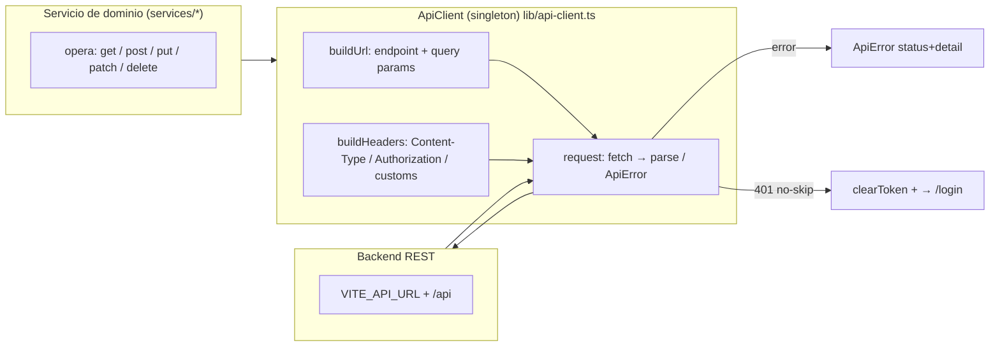

# Cliente HTTP y API — TurnoGo Frontend

Documentación del cliente HTTP (`src/lib/api-client.ts`), su configuración, y
el **catálogo completo de endpoints consumidos**, verificados uno a uno contra
el código fuente.

## 1. Cliente HTTP

- **Clase**: `ApiClient` (`src/lib/api-client.ts:30-217`), exportada como
  singleton `apiClient` (default export).
- **Mantenimiento de token**: no lee de `localStorage`; lo recibe del exterior
  vía `setToken(token)` y lo limpia con `clearToken()`. `AuthContext` es quien
  le inyecta el token (persiste en `turnexo_token`).
- **Base**: `request(endpoint, options, baseUrl?)`. Endpoints públicos usan el
  default `API_BASE_URL`; el cliente puede apuntar a otra base
  (`getWithBase` / `postWithBase`) — usado solo por auth.

## 2. Configuración

Definida en `src/lib/api-config.ts`:

| Constante | Valor |
|-----------|-------|
| `API_HOST` | `import.meta.env.VITE_API_URL \|\| "http://localhost:8000"` |
| `API_BASE_URL` | `` `${API_HOST}/api` `` |
| `AUTH_API_ROOT` | `import.meta.env.VITE_AUTH_API_ROOT \|\| `${API_BASE_URL}/auth`` |

Ejemplo con valores por defecto: `http://localhost:8000/api/...` y
`http://localhost:8000/api/auth/...`.

> `API_CONFIG.endpoints` (mapa de rutas en inglés) está declarado pero **no es
> utilizado por ningún servicio** (código sin uso; ver ARQUITECTURA.md §6).

## 3. Construcción de la solicitud

En `ApiClient.request` (`src/lib/api-client.ts:87-147`):

1. **URL** (`buildUrl`): concatena `baseUrl + endpoint` y serializa `params`
   con `URLSearchParams` (ignora valores `null`/`undefined`).
2. **Headers** (`buildHeaders`):
   - `Content-Type: application/json` si el body **no** es `FormData`.
   - `Authorization: Bearer ${token}` si hay token y no se pidió `omitAuth`.
   - Se fusionan headers custom.
3. **Body**: `JSON.stringify(body)` para `POST`/`PUT`/`PATCH`; `FormData` se
   envía tal cual.
4. **Respuesta**:
   - `!response.ok` → parsea `errorData.detail || errorData.message` y lanza
     `ApiError(message, status, detail)`.
   - `204` o body vacío → `{}` (tipado como `T`).
   - De lo contrario → `JSON.parse(text)`.
5. **Excepciones**: cualquiera del `fetch` se re-lanza (tras `console.error`).

### Opciones de `request`

| Opción | Efecto |
|--------|--------|
| `method` | `GET` (default), `POST`, `PUT`, `PATCH`, `DELETE` |
| `headers` | headers adicionales |
| `body` | object/`FormData` para métodos con cuerpo |
| `params` | query params (`string \| number \| boolean`) |
| `skipAuthRedirect` | `true` ⇒ no redirigir a `/login` ante `401` |
| `omitAuth` | `true` ⇒ no enviar `Authorization` |

## 4. Métodos públicos

| Método | Firma | Uso |
|--------|-------|-----|
| `get<T>(endpoint, params?)` | GET con query params | lecturas |
| `post<T>(endpoint, body?, headers?)` | POST JSON/FormData | creación |
| `put<T>(endpoint, body?, headers?)` | PUT | actualización completa |
| `patch<T>(endpoint, body?, headers?)` | PATCH | actualización parcial / toggle |
| `delete<T>(endpoint, params?)` | DELETE | eliminación |
| `getWithBase<T>(baseUrl, endpoint, params?)` | GET a otra base | auth (`/auth/me`, `verify-email`) |
| `postWithBase<T>(baseUrl, endpoint, body?, headers?, skipAuthRedirect?, omitAuth?)` | POST a otra base | auth |

## 5. Autenticación en las solicitudes

- **Header**: `Authorization: Bearer <token>`, con token en memoria del
  singleton (seteado por `AuthContext`).
- **Endpoints de auth** envían `skipAuthRedirect: true` y `omitAuth: true`
  (login, registro, Google, 2FA, reset) para no forzar redirección ni enviar
  token inexistente. Ver `postWithBase(..., true, true)` en
  `src/features/auth/services/auth.service.ts`.
- **401 global**: ante un `401` en el resto de endpoints, el cliente limpia el
  token y hace `window.location.href = "/login"`.

## 6. Manejo de errores

- Tipo `ApiError` (extends `Error`): `.status` (HTTP) y `.detail`.
- Deriva del parseo de la respuesta no-OK: usa `detail`, luego `message`, y
  si no hay body JSON devuelve `HTTP <status>`.
- Construcción de mensajes legibles: `getApiErrorMessage(error, fallback)` en
  `src/lib/api-error.ts` (usado por mutations vía `toast.error`).
- Fallbacks de compatibilidad en servicios:
  - `businessService.getMyBusiness`: ante 404/405 busca el negocio en
    `GET /negocios/` filtrando por `usuario_id`.
  - `clienteService.upsertClient`: ante 404 usa `POST /clientes/`.
  - `horarioService.getByBusiness`: ante 404 lee `GET /negocios/:id` y usa
    `business.horarios`.
  - `estadisticaService.getByBusiness`: ante 404/405/501 usa solo el cálculo
    local.
- Verbo `DELETE` en servicios usa "soft delete" (activo=false) por convención
  del backend (documentado en `servicio.service.ts`).

## 7. Catálogo de endpoints (verificados)

Convenciones usadas en la tabla: `{ }` indica parámetro de path; `` `body`
`` documenta el JSON enviado; *tipo* es lo que el servicio devuelve al llamador.

### 7.1 Negocios y categorías — `src/services/business.service.ts`

| Método | Path | Parámetros / body | Respuesta |
|--------|------|-------------------|-----------|
| `GET` | `/negocios/` | `params?` passthrough (uso desde `useBusinesses`: `category`, `city`, `page`, `limit`) | `ApiNegocio[]` |
| `GET` | `/negocios/admin` | — | `ApiNegocio[]` |
| `GET` | `/negocios/{id}` | — | `ApiNegocio` |
| `GET` | `/negocios/slug/{slug}` | — | `ApiNegocio` |
| `GET` | `/negocios/me` | — | `ApiNegocio` |
| `GET` | `/negocios/mapa` | — | `NegocioMapa[]` |
| `POST` | `/negocios/complete` | body `CreateCompleteBusinessRequest` (negocio + `servicios[]` + `empleados[]`) | `{ id_negocio }` |
| `PUT` | `/negocios/{id}` | body de `buildUpdatePayload` (nombre, wsp, telefono, direccion, ciudad, ig_url, logo, activo, usuario_id…) o `Partial<ApiNegocio>` (admin) | `ApiNegocio` |
| `DELETE` | `/negocios/{id}` | — | void |
| `GET` | `/categorias/` | — | `ApiCategory[]` |

### 7.2 Servicios — `src/services/servicio.service.ts` (BASE = `/servicios/`)

| Método | Path | Parámetros / body | Respuesta |
|--------|------|-------------------|-----------|
| `GET` | `/servicios/` | params `{ id_negocio }` | `ApiServicio[]` (filtro client-side por `activo`) |
| `POST` | `/servicios/` | `ServicioCreatePayload` (`id_negocio`, `nombre_servicio`, `precio`, `duracion_min`, `duracion_max`, `requiere_aprobacion`, `activo`) | `ApiServicio` |
| `PUT` | `/servicios/{id}` | `ServicioUpdatePayload` (parcial) | `ApiServicio` |
| `PATCH` | `/servicios/{id}` | sin body (toggle activo/inactivo) | `ApiServicio` |
| `DELETE` | `/servicios/{id}` | — | `ApiServicio` \| void |

### 7.3 Empleados — `src/services/empleado.service.ts`

| Método | Path | Parámetros / body | Respuesta |
|--------|------|-------------------|-----------|
| `GET` | `/empleados/?id_negocio={businessId}` | query inline | `ApiEmpleado[]` |
| `GET` | `/empleados/{employeeId}` | — | `ApiEmpleado` |
| `POST` | `/empleados/` | `Omit<ApiEmpleado, "id_empleado">` (normalizado) | `ApiEmpleado` |
| `PUT` | `/empleados/{id}` | parcia (nombre/apellido/telefono/activo) | `ApiEmpleado` |
| `PATCH` | `/empleados/{id}` | `{ activo }` | `ApiEmpleado` |
| `DELETE` | `/empleados/{id}` | — | void |

### 7.4 Horarios — `src/services/horario.service.ts`

| Método | Path | Parámetros / body | Respuesta |
|--------|------|-------------------|-----------|
| `GET` | `/horarios/{businessId}` | — | `ApiHorario[]` |
| `POST` | `/horarios/{businessId}` | body `BusinessSchedulePayload[]` (`dia_semana`, `hora_apertura`, `hora_cierre`) | void |
| `PUT` | `/horarios/{businessId}` | body `BusinessSchedulePayload[]` (si `hasExisting`) | void |
| `GET` | `/horarios/{horarioId}` | — | `ApiHorario` |
| `PUT` | `/horarios/{horarioId}` | `Partial<BusinessSchedulePayload>` | `ApiHorario` |
| `DELETE` | `/horarios/{horarioId}` | — | void |

### 7.5 Clientes — `src/services/cliente.service.ts`

| Método | Path | Parámetros / body | Respuesta |
|--------|------|-------------------|-----------|
| `POST` | `/clientes/get-or-create` | `{ telefono, nombre, apellido, email? }` | `ClientResponse` |
| `POST` | `/clientes/` | `{ telefono, nombre, apellido, email? }` (fallback 404) | `ClientResponse` |

### 7.6 Turnos — `src/features/booking/services/appointment.service.ts`

| Método | Path | Parámetros / body | Respuesta |
|--------|------|-------------------|-----------|
| `POST` | `/turnos/` | `{ id_negocio, id_cliente, id_servicio, fecha_hora_inicio, id_empleado }` | `ApiTurno` |
| `GET` | `/turnos/{id}` | — | `ApiTurno` |
| `GET` | `/turnos/por-rango` | `{ id_negocio, desde, hasta, id_empleado? }` (fechas en ISO local: `YYYY-MM-DDTHH:mm:SS±HH:mm`) | `ApiTurno[]` |
| `PUT` | `/turnos/{id}` | `Partial<CreateAppointmentRequest>` | `ApiTurno` |
| `PUT` | `/turnos/{id}/estado` | `{ id_estado, rechazado_motivo? }` | `ApiTurno` |
| `DELETE` | `/turnos/{id}` | — | `ApiTurno` |

### 7.7 Usuarios (admin) — `src/services/user.service.ts`

| Método | Path | Parámetros / body | Respuesta |
|--------|------|-------------------|-----------|
| `GET` | `/usuarios/admin` | — | `ApiUsuario[]` |
| `PUT` | `/usuarios/{id}` | `UpdateUserRequest` (`usuario_us`, `email_us`, `role_us`, `estado`) | `ApiUsuario` |
| `PATCH` | `/usuarios/{id}/estado` | `{ estado }` | `ApiUsuario` |
| `DELETE` | `/usuarios/{id}` | — | void |

### 7.8 Autenticación — `src/features/auth/services/auth.service.ts` y `VerifyEmailPage.tsx`

Base: `AUTH_API_ROOT` (default `/api/auth`). Todos con `skipAuthRedirect` y
`omitAuth`, excepto `GET /me` y `GET /verify-email/:token`.

| Método | Path | Parámetros / body | Respuesta |
|--------|------|-------------------|-----------|
| `POST` | `/login` | `{ email_us, contrasena_us }` | `{ access_token, token_type }` \| `{ requires_2fa: true, email }` |
| `POST` | `/register` | `{ usuario_us, email_us, contrasena_us, nombre_us, apellido_us }` + roles `duenio` | `{ access_token, token_type }` |
| `GET` | `/me` | — | `AuthUserResponse` (`id_us`, `email_us`, `usuario_us`, `has_business`, `negocio_id`, `negocio_slug`, `role`…) |
| `POST` | `/google` | `{ id_token }` | `{ access_token, token_type }` \| `{ message, email }` (verificación pendiente) |
| `POST` | `/forgot-password` | `{ email_us }` | void |
| `POST` | `/reset-password/{token}` | `{ new_password, confirm_password }` | void |
| `POST` | `/verify-credentials` | `{ email_us, contrasena_us }` | void |
| `POST` | `/verify-2fa` | `{ email_us, otp_code }` | `{ access_token, token_type }` |
| `GET` | `/verify-email/{token}` | — | `{ access_token, token_type }` |

> `VerifyEmailPage.tsx` consume `/auth/verify-email/{token}` con
> `apiClient.get` directo (no usa `getWithBase`), por lo que la ruta se arma
> contra `API_BASE_URL` (`/api/auth/verify-email/...`).

### 7.9 Planes, suscripción y pagos — `src/features/membership/services/membership.service.ts`

| Método | Path | Parámetros / body | Respuesta |
|--------|------|-------------------|-----------|
| `GET` | `/planes/` | — | `ApiPlan[]` |
| `GET` | `/planes/negocios/{idNegocio}/funciones` | — | `ApiNegocioFunciones` (`plan`, `estado`, `fecha_fin`, `funciones[]`) |
| `GET` | `/pagos/suscripcion/actual` | — | `ApiSuscripcion` \| `null` |
| `POST` | `/pagos/crear-preferencia` | body `{ id_plan }` | `{ init_point, preference_id }` (redirección al Checkout de Mercado Pago) |
| `POST` | `/pagos/suscripcion/{idSuscripcion}/cancelar` | — | `ApiSuscripcion` |
| `PUT` | `/pagos/suscripcion/{idSuscripcion}/renovacion-automatica` | `{ renovacion_automatica: boolean }` | `ApiSuscripcion` |

### 7.10 Estadísticas — `src/services/estadistica.service.ts`

| Método | Path | Parámetros / body | Respuesta |
|--------|------|-------------------|-----------|
| `GET` | `/statistics/business/{businessId}` | query `{ date_start, date_end }` (YYYY-MM-DD) | payload parcial (merge client-side); ante 404/405/501 se ignora |

El frontend además alimenta los KPI con las llamadas de los §7.2–7.4 y
`/turnos/por-rango` (§7.6).

## 8. Formato de fechas y zonas horarias

`src/lib/datetime-utils.ts` (usado por turnos y estadísticas):

- `buildLocalDateTimeString(date, time)` genera strings **con offset local**
  (`YYYY-MM-DDTHH:mm:SS±HH:mm`) deliberadamente, evitando
  `toISOString()` (UTC).
- `getLocalDayRange` / `getLocalWeekRange` producen rangos `{ desde, hasta }`
  para `/turnos/por-rango` y para el cálculo de `date_start/date_end`.

## 9. Notas finales

- **No hay inventario de endpoints**: esta tabla es el resultado de auditar
  cada llamada a `apiClient.*`, `getWithBase` y `postWithBase` en el código.
- **Métodos no usados**: `getBusinessById` no tiene llamada desde una página en
  la versión analizada; `appointmentService.getAppointmentById`,
  `updateAppointment` y `deleteAppointment` tampoco fueron localizados en uso
  (siendo `updateAppointment` API de soporte). `API_CONFIG.endpoints` está sin
  uso (ver §2).
- **Autenticación de sus propios endpoints**: negocios/servicios/empleados/
  horarios/turnos/usuarios/estadísticas/planes/pagos requieren token
  (`Authorization: Bearer`); las de §7.8 (excepto `/me` y
  `/verify-email/:token`) se llaman sin token.