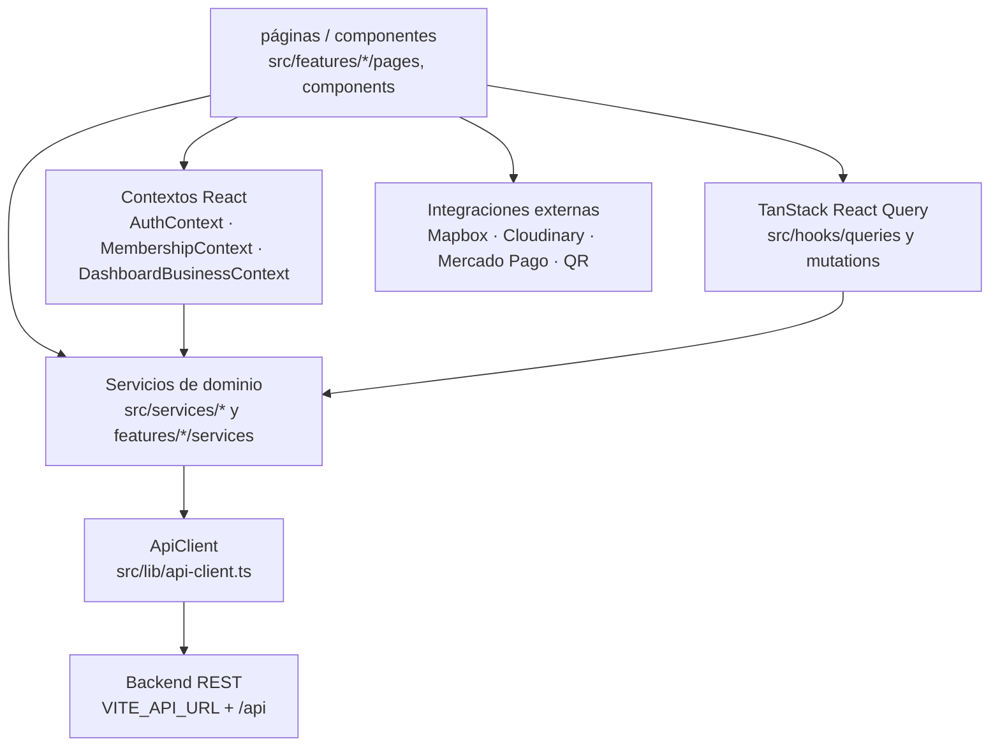
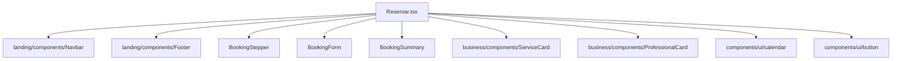
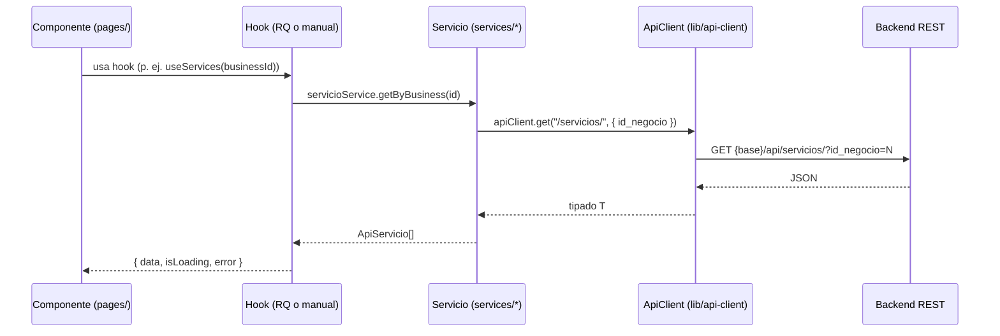
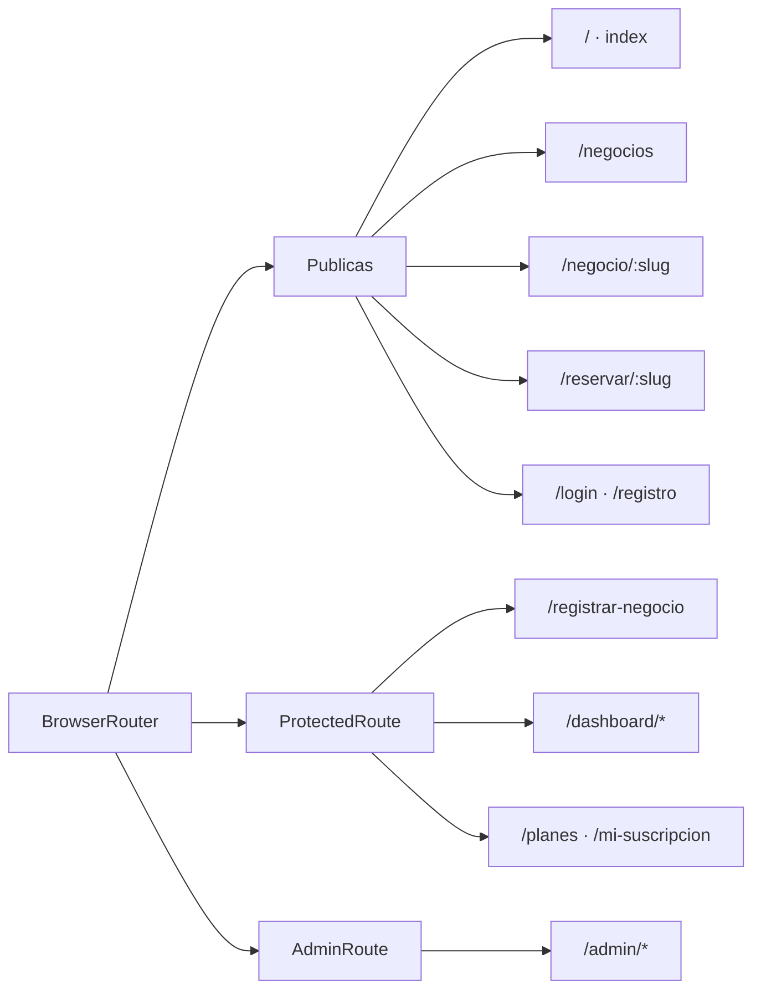
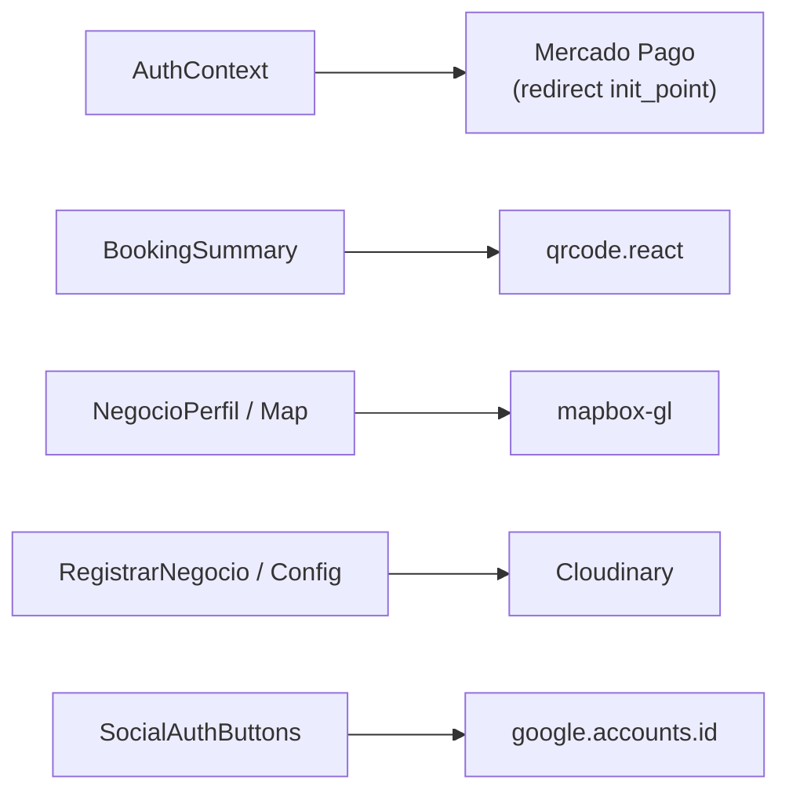

# Arquitectura del frontend — TurnoGo

## 1. Visión general

TurnoGo es una **SPA (Single Page Application)** construida con React 19,
Vite y TypeScript. Utiliza React Router para el enrutamiento del lado del
cliente y un cliente HTTP propio sobre `fetch` para comunicarse con un backend
REST externo.

No se encontró ninguna biblioteca de estado global (Redux, Zustand, Jotai) ni
framework de metadatos/SSR (Next.js): todo el ciclo de datos ocurre en el
navegador. El estado se reparte entre:
- **React Context** (predominantemente: autenticación, membresía y el negocio
  activo del dashboard),
- **TanStack React Query** (datos del servidor: caché, sincronización,
  invalidación),
- **estado local con `useState`** en páginas y componentes.



## 2. Arquitectura general

El proyecto sigue un patrón **por feature (carpetas por dominio de negocio)**
apilado sobre una capa de infraestructura compartida:

```mermaid
flowchart LR
    subgraph FEATURES["src/features/* — módulos de negocio"]
        A[auth] B[booking] C[business] D[dashboard] E[admin]
        F[landing] G[marketplace] H[membership] I[register-business]
    end
    subgraph SHARED["src — infraestructura compartida"]
        J[hooks] K[services] L[lib] M[components/ui] N[types]
    end
    FEATURES --> SHARED
    SHARED --> BK["ApiClient → backend"]
```

Características relevantes:

- **Entry point**: `src/main.tsx` → `src/App.tsx`.
- **Providers globales**: `QueryClientProvider`, `TooltipProvider`,
  `AuthProvider`, `MembershipProvider` y `BrowserRouter` se anidan en
  `src/App.tsx`.
- **Lazy loading**: `Planes`, `MiSuscripcion` y `ResultadoPago` se cargan con
  `React.lazy` (`src/App.tsx:19-21`).
- **Lógica de presentación mezclada con datos**: varias páginas realizan
  fetching manual con `useState`/`useEffect` (p. ej. `Reservar.tsx`,
  `Negocios.tsx`) en lugar de usar hooks de React Query; esto convive con la
  capa React Query (ver §6 para la distinción real).

## 3. Capas y responsabilidades

| Capa | Ubicación | Responsabilidad |
|------|-----------|-----------------|
| UI / presentación | `src/features/*/pages` y `*/components` | Pantallas, composición visual, eventos de usuario. |
| UI genérica (design system) | `src/components/ui/*` | Componentes shadcn/ui sobre primitivas Radix. |
| Estado de sesión / contexto | `src/features/auth/contexts/AuthContext.tsx`, `src/features/membership/contexts/MembershipContext.tsx`, `src/features/dashboard/contexts/DashboardBusinessContext.tsx` | Estado compartido consumido por árboles de componentes. |
| Datos / caché | `src/hooks/queries/*`, `src/hooks/mutations/*`, `src/hooks/useApi.ts`, `src/hooks/useEstadistica.ts` | Hooks de React Query (queries y mutations) y utilidades de caché. |
| Servicios de dominio | `src/services/*.ts` y `src/features/{auth,booking,membership}/services/*.ts` | Definición de operaciones de API por entidad (negocio, servicio, empleado, horario, turno, cliente, usuario, estadística, auth, pago, suscripción). |
| Transporte HTTP | `src/lib/api-client.ts`, `src/lib/api-config.ts`, `src/lib/api-error.ts` | Request único, headers, manejo de errores y base de URLs. |
| Utilidades / dominio puro | `src/lib/datetime-utils.ts`, `src/lib/schedule-utils.ts`, `src/lib/statistics-utils.ts`, `src/utils/format.ts` | Lógica de fechas/horarios, generación de estadísticas y formato. |
| Tipos | `src/types/api.ts`, `src/types/statistics.ts` | Contratos con el backend. |

## 4. Relación entre componentes

La composición es **vertical por feature**: cada módulo define sus propias
páginas y componentes, que importan componentes compartidos de
`src/components/ui/*` y piezas del propio módulo.

Ejemplo real del módulo de reserva (`src/features/booking/pages/reserva/Reservar.tsx`):



Los "contenedores de estado" (`Dashboard.tsx` con
`DashboardBusinessProvider`) envuelven contenido que consumen sus props/contexto.
Los componentes de UI son **presentacionales** y no consultan la API
directamente; las únicas excepciones son `src/components/ui/image-upload.tsx`
(subida a Cloudinary) y `src/components/ui/map-page.tsx` (mapa global, sin uso).

Existen dos componentes de **guard** que envuelven subárboles protegidos:
`src/features/auth/components/ProtectedRoute.tsx` y
`src/features/admin/components/AdminRoute.tsx` (ver §10).

## 5. Relación entre UI, lógica y acceso a datos

El flujo estándar es: **componente → hook (React Query o manual) → servicio de
dominio → ApiClient → fetch → backend**.



Caso particular: en `src/features/booking/pages/reserva/Reservar.tsx` el acceso a
datos es **manual** (llamadas directas a `businessService`,
`servicioService`, `empleadoService`, `horarioService`, `clientService` y
`appointmentService`, sin pasar por React Query). En cambio, el dashboard usa
hooks de React Query (`useAppointments`, `useServices`, `useEmployees`,
`useHorarios`, `useStatistics`).

**Normalización de datos** en el borde: los servicios tipan la respuesta y
normalizan campos (p. ej. `servicioService.getByBusiness` filtra por
`id_negocio` y por `activo`; `userService.normalizeUser` mapea el payload;
`AuthContext.normalizeUser` transforma el usuario del backend al modelo interno).

## 6. Comunicación con el backend

### Cliente HTTP

`src/lib/api-client.ts` define `ApiClient`, una clase singleton (exportada como
`apiClient`) que envuelve `fetch`:

- **Base URL**: `src/lib/api-config.ts` calcula
  `API_BASE_URL = (VITE_API_URL || "http://localhost:8000") + "/api"`.
- **Ruta de auth separada**: `AUTH_API_ROOT = VITE_AUTH_API_ROOT || API_BASE_URL + "/auth"`.
  Se usa con `getWithBase`/`postWithBase` (patrón de microservicio), empleado
  únicamente por `src/features/auth/services/auth.service.ts`.
- **Autenticación**: inyecta `Authorization: Bearer <token>` en memoria
  (seteado por `AuthContext` vía `apiClient.setToken`). La exclusión del header
  se controla con `omitAuth`.
- **Cuerpo**: `JSON.stringify` salvo `FormData` (para subidas); header
  `Content-Type: application/json` se omite para `FormData`.
- **Query params**: se serializan con `URLSearchParams` (ignora `null`/`undefined`).
- **Errores**: una respuesta no-OK lanza `ApiError` (estatus HTTP + `detail`).
- **401 automático**: si llega `401` y no se usó `skipAuthRedirect`, limpia el
  token y redirige a `/login` (window.location). Los endpoints de auth pasan
  `skipAuthRedirect: true` para evitar bucles de redirección.
- **Respuesta vacía** (`204` o body vacío): devuelve `{}` para conservar el tipo.

### Endpoints usados (paths reales)

| Recurso | Endpoints | Servicio |
|---------|-----------|----------|
| Negocios | `/negocios/`, `/negocios/slug/:slug`, `/negocios/me`, `/negocios/complete`, `/negocios/mapa`, `/negocios/admin`, `/negocios/:id` | `src/services/business.service.ts` |
| Categorías | `/categorias/` | `src/services/business.service.ts` |
| Servicios | `/servicios/`, `/servicios/:id` (PUT/PATCH/DELETE) | `src/services/servicio.service.ts` |
| Empleados | `/empleados/`, `/empleados/:id` | `src/services/empleado.service.ts` |
| Horarios | `/horarios/:id` (GET/POST/PUT) | `src/services/horario.service.ts` |
| Clientes | `/clientes/get-or-create`, `/clientes/` | `src/services/cliente.service.ts` |
| Turnos | `/turnos/`, `/turnos/por-rango`, `/turnos/:id`, `/turnos/:id/estado` | `src/features/booking/services/appointment.service.ts` |
| Usuarios | `/usuarios/admin`, `/usuarios/:id`, `/usuarios/:id/estado` | `src/services/user.service.ts` |
| Auth | `/auth/login`, `/auth/register`, `/auth/me`, `/auth/google`, `/auth/forgot-password`, `/auth/reset-password/:token`, `/auth/verify-credentials`, `/auth/verify-2fa`, `/auth/verify-email/:token` | `src/features/auth/services/auth.service.ts` |
| Planes / suscripción | `/planes/`, `/planes/negocios/:id/funciones`, `/pagos/crear-preferencia`, `/pagos/suscripcion/actual`, `/pagos/suscripcion/:id/cancelar`, `/pagos/suscripcion/:id/renovacion-automatica` | `src/features/membership/services/membership.service.ts` |
| Estadísticas | `/statistics/business/:id` (opcional; merge client-side) | `src/services/estadistica.service.ts` |

> **Nota de veracidad**: `src/lib/api-config.ts` declara además un mapa
> `API_CONFIG.endpoints` con rutas en inglés (`/businesses`, `/appointments`, …).
> Ningún servicio lo importa; el transporte real usa los paths en español
> listados arriba. Se trata de código heredado/sin uso, no de la ruta efectiva.

## 7. Utilización de React Query

Cliente por defecto: `const queryClient = new QueryClient();` en `src/App.tsx`,
provisto por `QueryClientProvider` a toda la app.

- **Queries** (en `src/hooks/queries/`):
  - `useServices(businessId, { includeInactive? })` → `["services", businessId, includeInactive]`.
  - `useEmployees(businessId)` → `["employees", businessId]`.
  - `useHorarios(businessId)` → `["horarios", businessId]`.
  - `useAppointments(businessId, range)` → `["appointments", businessId, desde, hasta]`.
  - `useStatistics(...)` (en `src/hooks/useEstadistica.ts`) → `["statistics", businessId, rango, comparar]`, con `keepPreviousData`.
  - Queries de membresía en `src/features/membership/hooks/useMembershipQuery.ts` (`["planes"]`, `["funciones-negocio", id]`, `["suscripcion-actual"]`).
  - Queries de negocio en `src/hooks/useApi.ts` (`["businesses"]`, `["my-business", userId]`, `["business", slug]`, `["categories"]`).
- **Config por defecto repetida**: `staleTime` de 5 minutos y `gcTime` de 10 en la mayoría de las queries de negocio; `enabled: businessId != null` desactiva la query cuando no hay ID (patrón común).
- **Mutations** (en `src/hooks/mutations/`):
  - Servicios: `useCreateService`, `useUpdateService`, `useToggleService`.
  - Empleados: `useCreateEmployee`, `useUpdateEmployee`, `useToggleEmployee`.
  - Horarios: `useUpdateHorarios`.
  - Negocio: `useUpdateBusiness` (`useBusinessService.ts`).
  - Membresía: `useCrearPreferencia`, `useCancelarSuscripcion`, `useToggleRenovacion` (`src/features/membership/hooks/useMembershipMutations.ts`).
  - En páginas específicas también hay mutations inline (p. ej.
    `statusMutation` en `src/features/dashboard/pages/subpages/DashboardTurnos.tsx`).
- **Invalidación**: `queryClient.invalidateQueries({ queryKey: [...] })` tras
  mutaciones para refrescar la caché (p. ej. tras cambiar el estado de un turno
  se invalidan `["appointments"]`; `MembershipContext.refresh` invalida
  `["funciones-negocio"]`).

## 8. Routing

Definido completamente en `src/App.tsx` con `BrowserRouter` + `<Routes>`.

- **Rutas públicas**: `/`, `/negocios`, `/negocio/:slug`, `/reservar/:slug`,
  `/login`, `/registro`, `/verificar-codigo`, `/olvide-contrasena`,
  `/restablecer-contrasena`, `/verify-email/:token` (con token en la URL),
  `/auth-success`.
- **Protegidas por `ProtectedRoute`** (requieren sesión y aplican lógica de
  rol): `/registrar-negocio`, `/dashboard/*`, `/planes`, `/mi-suscripcion`.
- **Solo admin**: `/admin/*` envuelto por `AdminRoute` + `ErrorBoundary`.
- **Lazy**: `/planes`, `/mi-suscripcion`, `/pagos/resultado` se cargan con
  `React.lazy` y `Suspense` con fallback `PageLoader`.
- **Catch-all**: `*` → `NotFound` (`src/features/landing/pages/NotFound.tsx`).
- **Deploy SPA**: `vercel.json` reescribe todas las rutas a `/index.html`.

Detalles de comportamiento:
- Animación de entrada de página (clase `page-enter`) según `location.pathname`,
  deshabilitada para `/login` y `/registro` (`ROUTES_WITHOUT_PAGE_ANIMATION`).
- Efecto `scroll-reveal` con `IntersectionObserver` sobre secciones semánticas.
- `SkipLink` de accesibilidad apunta a `#main-content`.



## 9. Manejo del estado

### 9.1 React Context

1. **`AuthContext`** (`src/features/auth/contexts/AuthContext.tsx`)
   - Mantiene `user`, `token`, `isLoading` y `pendingTwoFaEmail`.
   - Persiste en `localStorage`: `turnexo_token`, `turnexo_user`,
     `turnexo_pending_2fa_email`.
   - Al montar, si hay token guardado, revalida con `GET /auth/me`
     (`applySessionFromToken`).
   - Expone `login`, `loginWithToken`, `loginWithGoogle`, `register`,
     `verifyTwoFactorCode`, `verifyCredentials`, `requestPasswordReset`,
     `resetPassword`, `logout` y `setPendingTwoFaEmail`/`clearPendingTwoFaEmail`.

2. **`MembershipContext`** (`src/features/membership/contexts/MembershipContext.tsx`)
   - Consume `useAuth` para obtener el `negocioId` del usuario.
   - Carga funciones/plan vía `useFuncionesNegocio` (query React Query) y
     expone `planActual`, `estadoSuscripcion`, `fechaFin`, `funciones[]`,
     `isFree`, `tieneFuncion(key)` y `refresh`.

3. **`DashboardBusinessContext`** (`src/features/dashboard/contexts/DashboardBusinessContext.tsx`)
   - Provee el negocio activo (`business`), `isLoadingBusiness` y
     `refreshBusiness` (refetch). Creado por `Dashboard.tsx` a partir de
     `useMyBusiness(user.id)`.

### 9.2 React Query (caché de servidor)

Ver §7. React Query almacena los datos remotos, controla `isLoading`/`error` y
la invalidación después de mutaciones.

### 9.3 Estado local

Componentes y páginas usan `useState`/`useMemo`/`useCallback` (p. ej.
`Reservar.tsx`: `step`, `booking`, `occupiedAppointments`, `visibleMonth`, …).

> No existe ni Redux ni Zustand ni una capa de persistencia alternativa al
> `localStorage` descrito.

## 10. Autenticación y autorización

- **Flujo de login**: `Login.tsx` → `authService.login` (`POST /auth/login`).
  Si responde `requires_2fa`, guarda `pendingTwoFaEmail` y redirige a
  `/verificar-codigo` (OTP vía `authService.verifyTwoFactorCode`). Si devuelve
  `access_token`, aplica la sesión (`applySessionFromToken`) y navega según
  `redirectPath` (`location.state.from`) o `/dashboard`.
- **Google**: `src/features/auth/components/SocialAuthButtons.tsx` renderiza el
  botón con `google.accounts.id` (declaración global `Window.google` en línea)
  y envía el `id_token` a `POST /auth/google`. Utiliza retry con
  `setTimeout` (máx. 20 intentos/200 ms) esperando que el SDK esté disponible.
  > El script del SDK de Google (`accounts.google.com/gsi/client`) **no se
  > carga en `index.html`, `public/` ni en ningún componente**, y
  > `VITE_GOOGLE_CLIENT_ID` **no figura en `.env.local`**. Como está, la
  > inicialización fallaría salvo que el script se inyecte externamente. Es
  > una posible deuda/incidencia no resuelta en el código.
- **Verificación de email**: `VerifyEmailPage.tsx` llama
  `GET /auth/verify-email/:token`, recibe `access_token` y completa la sesión
  con `loginWithToken`, navegando luego a `/registrar-negocio`.
- **Roles y guardas**:
  - `ProtectedRoute.tsx`: if `role === "admin"` → permite hijos solo en
    `/admin`, `/planes`, `/mi-suscripcion`; si no, redirige a `/admin`. Si
    `role === "duenio"` sin `hasBusiness` → fuerza `/registrar-negocio`. Dueño
    con negocio intentando `/registrar-negocio` → `/dashboard`. Sin sesión →
    `/login` con `state.from`.
  - `AdminRoute.tsx`: exige `user.role === "admin"`; caso contrario redirige a
    `/dashboard` o `/login`.
  - `AdminPanel.tsx` además verifica el rol inline.
  - El registro de negocio (`RegistrarNegocio.tsx`) obtiene `user.id` del
    `AuthContext` para asociarlo al negocio.
  - `authService.register` fuerza el rol `"duenio"` en el payload.
- **Logout**: `AuthContext.logout` limpia estado y `localStorage` y limpia el
  token del cliente HTTP.
- **Sesión y 401**: el `ApiClient` redirige a `/login` ante cualquier `401`
  (excepto con `skipAuthRedirect`).

## 11. Integraciones externas

| Integración | Uso real | Ubicación |
|-------------|----------|-----------|
| **Mercado Pago** | Inicializa `initMercadoPago` con la public key y locale `es-AR`. El pago real es **redirect**: `POST /pagos/crear-preferencia` → `window.location.href = init_point` (`Planes.tsx`). No se renderizan componentes Wallet/Bricks. El resultado se lee por query param en `/pagos/resultado?status=...`. | `src/lib/mercadopago.ts`, `src/features/membership/pages/Planes.tsx`, `ResultadoPago.tsx` |
| **Mapbox GL** | Mapa con `mapboxgl.Map` (estilo `streets-v12`), marker y popup; token `VITE_MAPBOX_TOKEN`. Datos geográficos desde el backend (`latitud`/`longitud` en `ApiNegocio`, y `getNegociosMapa()`). CSS importado en `App.tsx`. | `src/features/business/components/Map.tsx` |
| **Cloudinary** | Subida directa de imágenes (unsigned preset) `POST https://api.cloudinary.com/.../image/upload`, validación `image/*` y máx. 5 MB, devuelve `secure_url`. | `src/components/ui/image-upload.tsx`, `src/lib/cloudinary.ts` |
| **Google (OAuth)** | Botón de login (no operativo tal como está; ver §10). | `src/features/auth/components/SocialAuthButtons.tsx` |
| **Google Calendar** | Enlace de "Añadir a Google Calendar" generado en el cliente para el turno confirmado. | `src/features/booking/components/BookingSummary.tsx` |
| **WhatsApp** | Solo como dato de negocio (`wsp`) y referencias de recordatorio; no hay integración de API de mensajería. | `src/types/api.ts` (`ApiNegocio.wsp`) |
| **Código QR** | Generación del código del turno con `QRCodeSVG`; el QR codifica un enlace profundo `{origin}/dashboard/turnos?turno=<id>`. **No hay escáner/lector.** | `src/features/booking/components/BookingSummary.tsx` |



## 12. Manejo de errores y estados de carga

- **Errores de API**: `ApiError` (`src/lib/api-client.ts`) expone `status` y
  `detail`; `getApiErrorMessage` (`src/lib/api-error.ts`) extrae mensaje legible.
- **Toast**: librería `sonner` (provider `Toaster` en `App.tsx`) para
  notificaciones (éxitos/errores de mutaciones, subidas de imagen).
- **Fallos por componente**: varias mutaciones registran `onError` con `toast.error`.
- **ErrorBoundary**: `src/components/error-boundary.tsx` (clase React) con
  fallback y botón de recarga; aplicado en rutas del dashboard, planes y admin.
- **Loading**: spinners, skeletons (`src/components/ui/skeleton.tsx`), textos
  "Cargando..." y config `isLoading`/`isPending` en páginas del dashboard;
  plugin de carga inline en `DashboardEstadisticas` (`isFetching`).
- **Redirecciones de sesión**: el `ApiClient` redirige a `/login` en `401`; los
  guards redirigen según estado de sesión/negocio.

## 13. Deuda técnica y observaciones

1. **Acceso a datos inconsistente**: mezcla de React Query
   (dashboard/admin/membership), hooks manuales y fetching con `useState`
   (`Reservar`, `Negocios`). Documentar la decisión de unificar.
2. **`API_CONFIG.endpoints` sin uso**: mapa de rutas en inglés que no se
   consulta (véase §6).
3. **Google OAuth presumiblemente roto**: sin script del SDK ni
   `VITE_GOOGLE_CLIENT_ID` en el entorno local.
4. **`next-themes` instalado pero sin uso**: no hay `ThemeProvider` ni `useTheme`
   en el código; el modo oscuro existe solo como CSS en `src/index.css`.
5. **`@react-oauth/google` instalado pero no usado**: el login usa la API
   global `google.accounts.id` manualmente.
6. **Código duplicado en sesión**: `AuthContext` y helpers de `auth.service`
   (`saveToken`, `getUser`, `clearSession`) conviven con solapamiento parcial.
7. **Doble provider de toasts**: `Toaster` (Radix) y `Sonner` conviven en
   `App.tsx`.
8. **Componente no usado**: `src/components/ui/map-page.tsx` (mapa global de
   negocios, `MapaPage`) no es importado por ninguna página; las llamadas a
   la API desde `ui/` quedan solo en `image-upload.tsx` (Cloudinary).