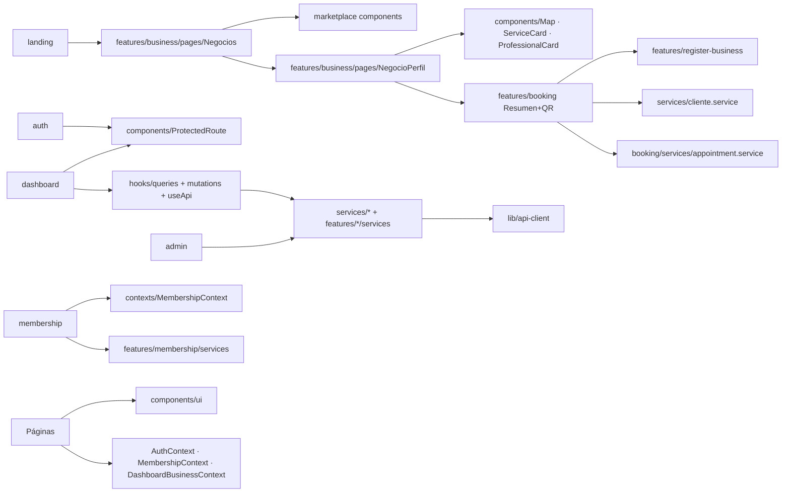

# Estructura del proyecto — TurnoGo Frontend

## 1. Resumen

El código fuente vive íntegramente en `src/`. La organización es **por
feature**: cada módulo de negocio ocupa `src/features/<modulo>/` y contiene sus
propias `pages/`, `components/`, `services/`, `contexts/` y `hooks/`. Las
piezas compartidas (cliente HTTP, utilidades, componentes de UI, tipos) están
en `src/lib`, `src/components/ui`, `src/hooks`, `src/services`, `src/types`.

```
Turnexo_front/
├─ .env.local                        # Variables de entorno (gitignoreado: *.local)
├─ components.json                   # Config de shadcn/ui
├─ eslint.config.js                  # ESLint 9 (flat config)
├─ index.html                        # HTML de entrada (meta + <div id="root">)
├─ package.json                      # Scripts y dependencias
├─ pnpm-lock.yaml                    # Lockfile (pnpm)
├─ pnpm-workspace.yaml               # allowBuilds: esbuild
├─ postcss.config.js                 # tailwindcss + autoprefixer
├─ tailwind.config.js                # Extensión de temas shadcn
├─ tsconfig.json                     # Proyecto con references
├─ tsconfig.app.json                 # Config de la app (bundler, strict)
├─ tsconfig.node.json                # Config para herramientas de build
├─ vercel.json                       # Rewrite SPA → /index.html
├─ vite.config.ts                    # Vite + alias "@" + vitest
├─ public/                           # icon.png, icon.ico
└─ src/
```

## 2. Archivos de configuración de la raíz

| Archivo | Función |
|---------|---------|
| `vite.config.ts` | Plugin React, alias `@` → `./src`, y bloque `test` de Vitest (jsdom, `globals`, `setupFiles: src/test/setup.ts`, cobertura en `src/lib/statistics-utils.ts` y `src/utils/format.ts`). |
| `tsconfig.json` | Proyecto contenedor con `references` a `tsconfig.app.json` y `tsconfig.node.json`. |
| `tsconfig.app.json` | App: `moduleResolution: bundler`, `paths: {"@/*": ["./src/*"]}`, `strict`, `noUnusedLocals`, `noUnusedParameters`, `jsx: react-jsx`, `noEmit`. |
| `tailwind.config.js` | `content` apunta a `index.html` y `src/**/*`, con la paleta basada en variables CSS (`hsl(var(--…))`) y tokens de shadcn. `plugins: []`. |
| `postcss.config.js` | `tailwindcss` + `autoprefixer`. |
| `components.json` | Registro de shadcn/ui (style *default*, alias `@/components`, `@/lib`, `@/hooks`, base color *slate*, `cssVariables: true`). |
| `eslint.config.js` | ESLint 9 *flat config*: `js.recommended`, `typescript-eslint`, `react-hooks`, `react-refresh`; ignora `dist`. |
| `vercel.json` | Rewrite de toda ruta a `/index.html` (imprescindible para SPA en Vercel). |
| `.env.local` | Contiene las variables `VITE_*` (ver `src/lib/api-config.ts`). **No versionada**. |

### Variables de entorno utilizadas en el código

Definidas en `src/lib/api-config.ts`, `src/lib/cloudinary.ts`,
`src/lib/mercadopago.ts`, `src/features/business/components/Map.tsx` y
`src/components/ui/image-upload.tsx`:

- `VITE_API_URL` — host del backend (sin `/api`).
- `VITE_AUTH_API_ROOT` — (opcional) raíz del servicio de auth.
- `VITE_MAPBOX_TOKEN` — token público de Mapbox.
- `VITE_CLOUDINARY_CLOUD_NAME` y `VITE_CLOUDINARY_UPLOAD_PRESET` — Cloudinary.
- `VITE_MERCADOPAGO_PUBLIC_KEY` — public key de Mercado Pago.
- `VITE_GOOGLE_CLIENT_ID` — referenciada en
  `src/features/auth/components/SocialAuthButtons.tsx` pero **no presente en
  `.env.local`**.

> Los valores reales no se documentan (secreto de entorno); solo se listan los
> nombres utilizados por el código.

## 3. Estructura de `src/`

### 3.1 `src/main.tsx` y `src/App.tsx`

- `main.tsx`: `createRoot` + render de `<App />`; importa `./index.css` y
  `@/lib/mercadopago` (inicializa Mercado Pago).
- `App.tsx`: **provider central** y **definición de todas las rutas**. Orden de
  anidamiento: `QueryClientProvider` → `TooltipProvider` → `BrowserRouter` →
  `AuthProvider` → `MembershipProvider` → `Suspense` → `AppRoutes`.

### 3.2 `src/index.css`

Tokens de diseño (variables CSS `:root` y `.dark`), fuentes de Google
(Inter + Space Grotesk), clases utilitarias de animación (`fade-in`,
`page-enter`, `scroll-reveal`, `scrollbar-hide`) y respeto a
`prefers-reduced-motion`.

### 3.3 Carpetas de nivel superior

| Carpeta | Responsabilidad |
|---------|-----------------|
| `src/components/` | Componentes globales no propios de una feature: `error-boundary.tsx`, `NavLink.tsx`, `legal/TermsAndConditionsDialog.tsx`, y `ui/` (design system). |
| `src/features/` | Módulos de negocio (ver §4). |
| `src/hooks/` | Hooks compartidos de datos (React Query) y utilidades: `queries/`, `mutations/`, `useApi.ts`, `useEstadistica.ts`, `use-mobile.tsx`, `use-toast.ts`. |
| `src/lib/` | Infraestructura: cliente HTTP, config, errores, utilidades de dominio. |
| `src/services/` | Servicios de dominio para entidades del backend. |
| `src/test/` | Setup de Vitest (`setup.ts`) y test de ejemplo (`example.test.ts`). |
| `src/types/` | Tipos compartidos que modelan el backend: `api.ts`, `statistics.ts`. |
| `src/utils/` | Utilidades puras de formato: `format.ts` (con su test). |
| `src/vite-env.d.ts` | Tipos de Vite (`vite/client`). |

## 4. Módulos (`src/features/`)

Cada módulo interno se organiza con convenciones propias, pero predomina el
patrón `pages/` (rutas) + `components/` (piezas) + `services/` (API de la
feature cuando existe) + `contexts/` (estado React) + `hooks/` (React Query).

### 4.1 `features/auth/` — autenticación

| Elemento | Archivo(s) | Rol |
|----------|-----------|-----|
| Contexto | `contexts/AuthContext.tsx` | Sesión, `login`, `register`, Google, 2FA, reset de password, `logout`. |
| Servicio | `services/auth.service.ts` | Llamadas a `/auth/*`; helpers de `localStorage`. |
| Guardas | `components/ProtectedRoute.tsx` | Rutas protegidas + lógica de roles. |
| Botón social | `components/SocialAuthButtons.tsx` | Botón de Google (`google.accounts.id`). |
| Páginas | `pages/Login.tsx`, `Registro.tsx`, `OlvideContrasena.tsx`, `RestablecerContrasena.tsx`, `VerificarCodigo.tsx`, `VerifyEmailPage.tsx`, `AuthSuccess.tsx` | Flujos de UI de login/registro/recuperación/verificación. |
| Tests | `pages/RestablecerContrasena.test.tsx`, `pages/VerificarCodigo.test.tsx` | Tests con Testing Library. |

### 4.2 `features/booking/` — reserva de turnos

| Elemento | Archivo(s) | Rol |
|----------|-----------|-----|
| Página | `pages/reserva/Reservar.tsx` | Stepper completo de reserva (4 pasos), generación de slots y calendario de ocupación. |
| Mapper | `pages/reserva/mapper.ts` | Transformaciones de datos de la reserva. |
| Componentes | `components/BookingForm.tsx`, `BookingSummary.tsx`, `BookingStepper.tsx` | Formulario del cliente, resumen + QR + Google Calendar, indicador de pasos. |
| Servicio | `services/appointment.service.ts` | CRUD de turnos (`/turnos/…`). |

### 4.3 `features/business/` — negocio público

| Elemento | Archivo(s) | Rol |
|----------|-----------|-----|
| Páginas | `pages/Negocios.tsx`, `pages/NegocioPerfil.tsx` | Marketplace con filtros; perfil público del negocio. |
| Componentes | `components/Map.tsx`, `ServiceCard.tsx`, `ProfessionalCard.tsx`, `HorarioCard.tsx`, `ScheduleEditor.tsx` | Mapa Mapbox, tarjetas de servicio/profesional, edición de horarios. |

### 4.4 `features/dashboard/` — panel del dueño

| Elemento | Archivo(s) | Rol |
|----------|-----------|-----|
| Página raíz | `pages/Dashboard.tsx` | Carga el negocio (`useMyBusiness`) y monta el layout con sidebar. |
| Subpáginas | `pages/subpages/DashboardResumen.tsx`, `DashboardTurnos.tsx`, `DashboardServicios.tsx`, `DashboardEmpleados.tsx`, `DashboardHorarios.tsx`, `DashboardConfiguracion.tsx`, `DashboardPersonalizacion.tsx`, `DashboardEstadisticas.tsx` | Cada sección del dashboard. |
| Forms | `pages/subpages/services/ServiceForm.tsx`, `EmployeeForm.tsx`, `DeactivateServiceDialog.tsx` | Formularios de gestión. |
| Stats | `components/stats/*` (`StatsHeader`, `StatsKpiCards`, `StatsInsights`, `StatsCharts`, `StatsExportButton`, `StatsRangeToggle`, `StatsSkeleton`, `StatsEmptyState`, `StatsEmployeeCard`) y `stats/tabs/*` (`ResumenTab`, `ClientesTab`, `ServiciosTab`, `IngresosTab`, `AgendaTab`, `AsistenciaTab`, `EmpleadosTab`) | UI de analítica. |
| Layout | `components/DashboardHeader.tsx`, `DashboardSidebar.tsx` | Header y menú lateral. |
| Contexto | `contexts/DashboardBusinessContext.tsx` | Provee el negocio activo. |

### 4.5 `features/membership/` — planes y pagos

| Elemento | Archivo(s) | Rol |
|----------|-----------|-----|
| Páginas | `pages/Planes.tsx`, `pages/MiSuscripcion.tsx`, `pages/ResultadoPago.tsx` | Selección de plan, detalle de suscripción, estado del pago. |
| Contexto | `contexts/MembershipContext.tsx` | Plan/funciones del negocio y `tieneFuncion()`. |
| Hooks | `hooks/useMembershipQuery.ts`, `hooks/useMembershipMutations.ts` | Queries y mutations de planes/suscripción. |
| Servicio | `services/membership.service.ts` | `/planes/…`, `/pagos/…`. |
| Componentes | `components/PlanCard.tsx`, `FeatureGuard.tsx`, `UpgradeBanner.tsx` | Tarjeta de plan, guard de features por plan. |

### 4.6 `features/register-business/` — alta de negocio

| Elemento | Archivo(s) | Rol |
|----------|-----------|-----|
| Página | `pages/RegistrarNegocio.tsx` | Wizard de 7 pasos con React Hook Form + Zod. |
| Esquema | `schema.tsx` | Validación con `zod`. |
| Mapper | `mapper.ts` | Convierte el form a `CreateCompleteBusinessRequest`. |
| Defaults | `defaults.ts` | Valores iniciales y `fieldsPerStep`, `STEPS`. |
| Pasos | `components/BusinessInfoStep.tsx`, `BusinessImageStep.tsx`, `BusinessContactStep.tsx`, `BusinessLocationStep.tsx`, `BusinessServicesStep.tsx`, `BusinessEmployeesStep.tsx`, `BusinessScheduleStep.tsx`, `SuccessView.tsx` | Cada paso del formulario. |

### 4.7 `features/landing/` — sitio público

| Elemento | Archivo(s) | Rol |
|----------|-----------|-----|
| Página | `pages/Index.tsx`, `pages/NotFound.tsx` | Home; error 404. |
| Componentes | `components/Navbar.tsx`, `Footer.tsx`, `Hero.tsx`, `BenefitsBusiness.tsx`, `BenefitsClients.tsx`, `Categories.tsx`, `HowItWorks.tsx`, `RecommendedBusinesses.tsx`, `VIPPlan.tsx`, `BusinessCTA.tsx` | Secciones de la landing. |

### 4.8 `features/marketplace/` — componentes del listado

`BusinessCard.tsx`, `BusinessesGrid.tsx` (grid de negocios), `CategoryFilter.tsx`,
`SearchBar.tsx`. Utilizados por `features/business/pages/Negocios.tsx`.

### 4.9 `features/admin/` — panel de administración

| Elemento | Archivo(s) | Rol |
|----------|-----------|-----|
| Página | `pages/AdminPanel.tsx` | Contenedor con sub-rutas `negocios` / `usuarios`. |
| Guard | `components/AdminRoute.tsx` | Restringe a rol `admin`. |
| Secciones | `components/AdminBusinessesSection.tsx`, `AdminUsersSection.tsx` | Listados. |
| Modales | `components/EditBusinessModal.tsx`, `EditUserModal.tsx`, `DeleteBusinessDialog.tsx`, `DeleteUserDialog.tsx` | Edición/borrado. |
| Nav | `components/AdminNavbar.tsx` | Navegación del panel. |

## 5. `src/components/ui/` (design system)

51 componentes basados en shadcn/ui sobre primitivas de **Radix UI**. Reutilizan
`cn()` de `src/lib/utils.ts`. Incluyen: `button`, `input`, `label`, `card`,
`dialog`, `sheet`, `drawer` (vaul), `dropdown-menu`, `select`, `popover`,
`calendar` (react-day-picker), `table`, `tabs`, `badge`, `avatar`, `skeleton`,
`tooltip`, `toaster`/`toast`/`use-toast`, `sonner`, `sidebar`, `chart`
(recharts), `form` (React Hook Form), `image-upload` (Cloudinary),
`map-page` (mapa global de negocios, componente `MapaPage`; **no importado por
ninguna pantalla** en la versión analizada), `input-otp`, `command` (cmdk), `carousel`
(embla), `resizable`, `accordion`, `alert-dialog`, `aspect-ratio`,
`breadcrumb`, `checkbox`, `collapsible`, `context-menu`, `hover-card`,
`menubar`, `navigation-menu`, `pagination`, `progress`, `radio-group`,
`scroll-area`, `separator`, `slider`, `switch`, `toggle`, `toggle-group`.
Componentes custom en la carpeta: `image-upload.tsx`.

## 6. `src/lib/` — infraestructura

| Archivo | Responsabilidad |
|---------|-----------------|
| `api-client.ts` | `ApiClient` + `apiClient` singleton + `ApiError`. |
| `api-config.ts` | `API_HOST`, `API_BASE_URL`, `AUTH_API_ROOT`, `API_CONFIG` (endpoints — sin uso real; ver ARQUITECTURA §6). |
| `api-error.ts` | `getApiErrorMessage`. |
| `cloudinary.ts` | `CLOUDINARY_CONFIG` (cloud name + preset). |
| `datetime-utils.ts` | `buildLocalDateTimeString`, `getLocalDayRange`, `getLocalWeekRange`, `DateTimeRange`. |
| `schedule-utils.ts` | `WEEK_DAYS`, `apiDayToWeekDayIndex`, `mapHorariosToWeekSchedule`, `mapWeekScheduleToPayload`, `defaultWeekSchedule`, etc. |
| `statistics-utils.ts` | Motor de estadísticas (950 líneas): `buildDashboardStatistics`, `getStatisticsPeriodRange`, `mapLegacySummaryToStatistics`, `mergeStatisticsPayload`, `exportStatisticsFile`, etc. |
| `utils.ts` | `cn(...)` = `twMerge(clsx(...))`. |
| `mercadopago.ts` | `initMercadoPago` con public key (locale `es-AR`). |
| `placeholders.ts` | Datos de ejemplo/placeholders. |

## 7. `src/hooks/` — capa de datos compartida

| Archivo | Contenido |
|---------|-----------|
| `queries/index.ts` | Re-exporta `useServices`, `useEmployees`, `useHorarios`, `useAppointments` (+ `getDayRange`, `getWeekRange`). |
| `queries/useAppointmentsQuery.ts` | `useAppointments(businessId, range)`, keys `["appointments", …]`. |
| `queries/useEmployeesQuery.ts` | `useEmployees(businessId)`. |
| `queries/useHorariosQuery.ts` | `useHorarios(businessId)`. |
| `queries/useServicesQuery.ts` | `useServices(businessId, { includeInactive? })`. |
| `mutations/index.ts` | Re-exporta mutations de servicios/horarios. |
| `mutations/useBusinessService.ts` | `useUpdateBusiness`. |
| `mutations/useCreateEmployee.ts`, `useUpdateEmployee.ts`, `useToggleEmployee.ts` | CRUD empleados. |
| `mutations/useCreateService.ts`, `useUpdateService.ts`, `useToggleService.ts` | CRUD servicios. |
| `mutations/useUpdateHorarios.ts` | Bulk de horarios. |
| `useApi.ts` | `useCreateBusiness`, `useBusinesses`, `useMyBusiness`, `useBusinessBySlug`, `useBusinessServices`, `useBusinessProfessionals`, `useCategories`. |
| `useEstadistica.ts` | `useStatistics(businessId, rango, comparar)`. |
| `use-mobile.tsx` | Detección de viewport móvil (para `sidebar`). |
| `use-toast.ts` | Hook del Toaster Radix. |

## 8. `src/services/` — servicios de dominio

| Archivo | Entidad | Operaciones principales |
|---------|---------|------------------------|
| `business.service.ts` | Negocio | `getAll`, `getAllAdmin`, `getBusinessById`, `getMyBusiness`, `getBusinessBySlug`, `createCompleteBusiness`, `getCategories`, `updateBusiness`, `delete`, `buildUpdatePayload`; `obtenerNegociosMapa`. |
| `cliente.service.ts` | Cliente | `getOrCreateClient`, `createClient`, `upsertClient`. |
| `empleado.service.ts` | Empleado | `getByBusiness`, `getById`, `create`, `update`, `toggleStatus`, `delete`. |
| `estadistica.service.ts` | Estadísticas | `getByBusiness` (cálculo local + merge con `/statistics/business/:id`). |
| `horario.service.ts` | Horario | `getByBusiness`, `createOrUpdate`, `getById`, `update`, `delete`. |
| `servicio.service.ts` | Servicio | `getByBusiness` (con soft-delete `activo`), `create`, `update`, `toggleStatus`, `delete`. |
| `user.service.ts` | Usuario (admin) | `getAllAdmin`, `update`, `toggleStatus`, `delete`. |

## 9. `src/types/` y `src/utils/`

- `types/api.ts`: modelos backend (`ApiUsuario`, `ApiCategory`, `ApiNegocio`,
  `ApiServicio`, `ApiEmpleado`, `ApiTurno`, `ApiHorario`, `ApiPlan`,
  `ApiSuscripcion`, `ApiNegocioFunciones`, `ApiCrearPreferenciaResponse`,
  `BookingData`, `Appointment`, `WeekSchedule`, alias `ApiBusiness`/`ApiService`/`ApiEmployee`).
- `types/statistics.ts`: `StatisticsRange`, `StatisticsCompare`, `TabValue`,
  `DashboardStatistics`, `MetricWithDelta`, etc.
- `utils/format.ts`: formato de texto/valores (test en `utils/format.test.ts`).

## 10. `src/test/`

- `setup.ts`: configuración de Testing Library/jest-dom para Vitest.
- `example.test.ts`: test de ejemplo.
- Cobertura configurada en `vite.config.ts` para `statistics-utils.ts` y `format.ts`.

## 11. Relación entre módulos



Flujos transversales clave:

1. **Todas las páginas** consumen `components/ui/*` y `lib/utils (cn)`.
2. **Los módulos que necesitan sesión** leen `AuthContext`
   (`ProtectedRoute`, `Dashboard`, `MembershipContext`, `RegistrarNegocio`,
   `Login`, `AdminPanel`).
3. **Dashboard ↔ hooks**: el dashboard se apoya en `hooks/queries/*` y
   `hooks/mutations/*`, que delegan en `services/*`.
4. **Reserva (booking)** accede directo a servicios de `src/services` y a
   `appointment.service` (sin React Query).
5. **Membership ↔ Auth**: `MembershipContext` depende de `AuthContext`
   (`user.negocioId`).
6. **Ver los guards** en ARQUITECTURA §10 para la navegación condicional.