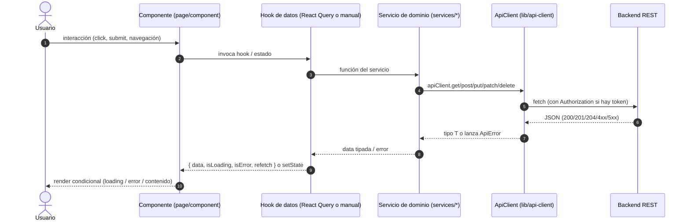
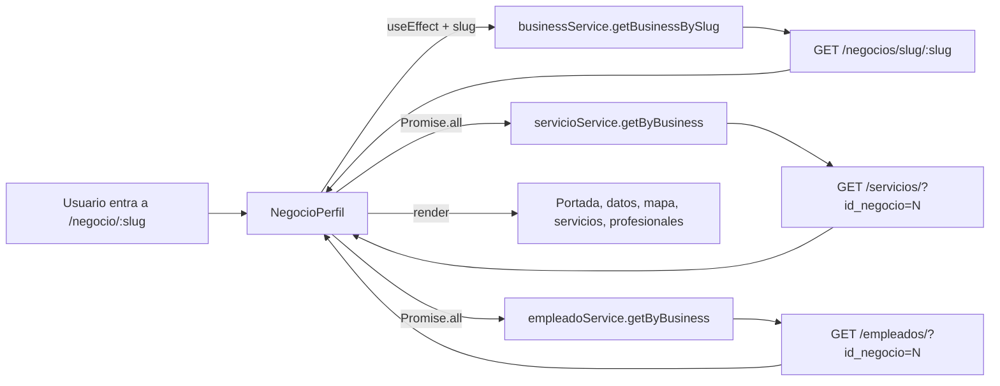
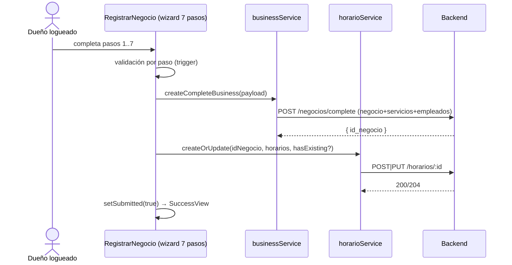

# Flujo de datos del frontend — TurnoGo

Este documento describe **cómo circula la información dentro del frontend** para
cada flujo real, desde la interacción del usuario hasta la actualización de la
interfaz. Complementa `ARQUITECTURA.md` (visión de capas) y `API_CLIENT.md`
(detalle del transporte HTTP).

## 1. Ciclo de datos genérico

Todo flujo de datos sigue, con variaciones, la misma cadena:



Existen **tres variantes** reales de la capa `H`:

| Variante | Dónde se usa | A cargo de |
|----------|--------------|-----------|
| **React Query (queries)** | Dashboard (`useAppointments`, `useServices`, `useEmployees`, `useHorarios`, `useStatistics`), membresía (`usePlanes`, `useFuncionesNegocio`, `useSuscripcionActual`), `useMyBusiness`, `useBusinessBySlug` | `src/hooks/queries/*`, `src/hooks/useApi.ts`, `src/hooks/useEstadistica.ts`, `src/features/membership/hooks/useMembershipQuery.ts` |
| **React Query (mutations)** | CRUD de servicios/empleados/horarios/negocio y acciones de membresía | `src/hooks/mutations/*`, `src/features/membership/hooks/useMembershipMutations.ts` |
| **Fetching manual** (`useState` + `useEffect`) | `Reservar.tsx`, `Negocios.tsx`, `NegocioPerfil.tsx`, `AdminBusinessesSection.tsx`, `AdminUsersSection.tsx` | las propias páginas/componentes |

## 2. Patrones transversales

### 2.1 Loading

- **React Query**: los componentes consultan `isLoading` / `isPending` /
  `isFetching` del resultado. El dashboard renderiza spinners (`Loader2`),
  skeletons (`components/ui/skeleton.tsx`) o mensajes "Cargando...".
- **Manual**: cada página declara su propio `isLoading` (`useState(true)`) y
  lo conmuta en `finally`.
- **Sesión**: `ProtectedRoute` y `AdminRoute` muestran un spinner mientras
  `AuthContext.isLoading` es `true`.

### 2.2 Errores

1. El `ApiClient` parsea `errorData.detail || errorData.message` y lanza
   `ApiError` (`src/lib/api-client.ts`) con `status` y `detail`.
2. La página/hook recibe el error y:
   - **Muestra `toast.error`** con `getApiErrorMessage(error, fallback)`
     (más común en mutaciones; `src/lib/api-error.ts`).
   - **Renderiza estado de error** inline en el componente (p. ej. banner en
     `Reservar.tsx`, tarjeta "Error al cargar turnos" en `DashboardResumen`).
3. Especial `401`: el `ApiClient` limpia el token y redirige a `/login`
   (excepto con `skipAuthRedirect`, usado por auth).

### 2.3 Actualización de la interfaz tras mutación

- **Invalidación de caché**: `queryClient.invalidateQueries({ queryKey })`
  tras el éxito de la mutación (p. ej. `["appointments"]`, `["services"]`,
  `["my-business"]`, `["suscripcion-actual"]`).
- **Escritura optimista en caché**: `queryClient.setQueryData` tras actualizar
  negocio (`useUpdateBusiness`).
- **Cambio de state local**: en flujos manuales se re-llama al fetch
  (`refreshOccupiedAppointments()`) o se actualiza `useState`.

## 3. Flujos reales

### F1. Ver detalle de un negocio público (`/negocio/:slug`)

**Componentes**: `NegocioPerfil.tsx` (`src/features/business/pages/NegocioPerfil.tsx`),
`Map.tsx`, `HorarioCard.tsx`, `ProfessionalCard.tsx`, `ServiceCard` (vía `BookButton`).
**Patrón**: fetching manual con `useState`/`useEffect`.



1. `useParams` lee `slug`; `useEffect` dispara la carga (`NegocioPerfil.tsx:29-59`).
2. `businessService.getBusinessBySlug(slug)` → `ApiNegocio`; con el
   `id_negocio` se piden en paralelo servicios y empleados.
3. **Respuestas**: `setBusiness`, `setServices`, `setProfessionals`.
4. **Interfaz**: header con datos, mapa (`latitud`/`longitud`), horarios,
   servicios con botón que navega a
   `/reservar/:slug?servicio={id_servicio}` (`NegocioPerfil.tsx:61-65`).
5. **Loading**: `isLoading` → "Cargando negocio...".
6. **Error**: `setError` → pantalla "Negocio no encontrado" con enlace a `/negocios`.

### F2. Reserva de turno (`/reservar/:slug`)

**Componentes**: `Reservar.tsx` (`src/features/booking/pages/reserva/Reservar.tsx`),
`BookingForm.tsx`, `BookingSummary.tsx`, `BookingStepper.tsx`, `ServiceCard`,
`ProfessionalCard`, `Calendar`.
**Patrón**: manual, con estado local `booking` y recálculo client-side de
disponibilidad.

**Carga inicial** (`Reservar.tsx:145-168`):
1. `businessService.getBusinessBySlug` + `Promise.all` de servicios, profesionales
   y horarios → `setBusiness`, `setServices`, `setProfessionals`.

**Paso 2 — fechas/horarios** (`Reservar.tsx:213-286`):
1. `refreshOccupiedAppointments`: `appointmentService.getAppointmentsByRange`
   (`GET /turnos/por-rango`) con `id_negocio`, `desde`/`hasta` del día y
   `id_empleado` si hay profesional elegido.
2. `refreshOccupiedDays` (por mes): misma llamada para todo el mes para marcar
   días sin cupos en el calendario.
3. `generateTimeSlots` computa slots de 30 min contra los horarios del negocio y
   los turnos ocupados (overlap), descartando horarios pasados.
4. **Loading**: `isLoadingSlots` → skeleton de 12 bloques pulsantes.
5. **Error**: catch → `setOccupiedAppointments([])`; formulario sigue usable.

**Confirmación — paso 4** (`Reservar.tsx:297-342`):
1. `clientService.upsertClient({ telefono, nombre, apellido, email })` →
   `POST /clientes/get-or-create` (fallback `POST /clientes/` si 404) → `ClientResponse`.
2. `appointmentService.createAppointment({ id_negocio, id_cliente,
   id_servicio, id_empleado, fecha_hora_inicio })` → `POST /turnos/` → `ApiTurno`
   (se guarda `createdTurnoId`).
3. Se refresca la ocupación y se avanza a `step 4` (pantalla de éxito con
   `BookingSummary` y QR).
4. **Error 409** (conflicto/ya no disponible): vuelve al paso 2 con el horario
   limpio y `submitError`.

```mermaid
flowchart TD
    R[Reservar stepper] -->|Paso 3 submit| UPS[clientService.upsertClient]
    UPS --> CL[POST /clientes/get-or-create | /clientes/]
    CL --> R
    R -->|id_cliente| CRE[appointmentService.createAppointment]
    CRE --> TU[POST /turnos/]
    TU -->|409?| R2[Volver al paso 2 - slot limpio]
    TU -->|OK| OK2[step 4 - BookingSummary + QR /dashboard/turnos?turno=id]
```

### F3. Autenticación

#### 3.1 Login con email/contraseña (`/login`)

**Componentes**: `Login.tsx` (`src/features/auth/pages/Login.tsx`).
**Hooks**: `useAuth` (`src/features/auth/contexts/AuthContext.tsx`).
**Servicio**: `authService` (`src/features/auth/services/auth.service.ts`).

1. `useForm` + `zodResolver` valida `email`/`password` en cliente.
2. `useAuth().login(email, password)` → `authService.login`
   (`POST /auth/login`, body `{ email_us, contrasena_us }`).
3. **Respuesta posible**:
   - `{ access_token }` → `applySessionFromToken`: persiste token en
     `localStorage`, `apiClient.setToken`, consulta `GET /auth/me`, normaliza el
     usuario y lo guarda. Navega a `redirectPath || "/dashboard"`.
   - `{ requires_2fa, email }` → guarda `pendingTwoFaEmail` y navega a
     `/verificar-codigo` → `POST /auth/verify-2fa` con `{ email_us, otp_code }` →
     `access_token` → sesión aplicada.
4. **Error**: `normalizeApiDetail` → `setServerError` → banner de error en el form.

#### 3.2 Verificación de email (`/verify-email/:token`)

`VerifyEmailPage.tsx` (`src/features/auth/pages/VerifyEmailPage.tsx`):
`apiClient.get("/auth/verify-email/:token")` → `{ access_token }` →
`useAuth().loginWithToken(token)` (aplica sesión vía `/auth/me`) → redirige a
`/registrar-negocio` a los 2 s.

#### 3.3 Restablecer contraseña

`OlvideContrasena.tsx` → `POST /auth/forgot-password` `{ email_us }`.
`RestablecerContrasena.tsx` → `POST /auth/reset-password/:token`
`{ new_password, confirm_password }`. Ambos a través de `useAuth`.

### F4. Registro de negocio (`/registrar-negocio`)

**Componentes**: `RegistrarNegocio.tsx`
(`src/features/register-business/pages/RegistrarNegocio.tsx`) + pasos
(`BusinessInfoStep`, `BusinessImageStep`, `BusinessContactStep`,
`BusinessLocationStep`, `BusinessServicesStep`, `BusinessEmployeesStep`,
`BusinessScheduleStep`, `SuccessView`).
**Formulario**: React Hook Form + `zodResolver` (`schema.tsx`), validación por
paso con `trigger(fieldsPerStep[step])`.



1. `user.id` proviene de `AuthContext` (`useAuth`).
2. `mapper.ts` (`toCreateCompleteBusinessRequest`) normaliza el form al payload.
3. Se calcula `idNegocio` de la respuesta (`getBusinessIdFromResponse`) y luego
   se guardan los horarios (`formatScheduleForBackend` mapea días → `dia_semana`).
4. **Errores**: `toast.error("Hubo un problema al registrar el negocio.")`.
   **Loading**: `isLoading` → texto "Registrando...".

### F5. Dashboard: carga del negocio activo (`/dashboard/*`)

`Dashboard.tsx` (`src/features/dashboard/pages/Dashboard.tsx`):
1. `useAuth()` → `user.id`.
2. `useMyBusiness(user.id)` (`src/hooks/useApi.ts`) → `businessService.getMyBusiness`
   → `GET /negocios/me` (fallback `GET /negocios/` + filtro por `usuario_id`
   cuando backend responde 404/405).
3. Resultado inyectado vía `DashboardBusinessProvider` (contexto) para todas las
   subpáginas.
4. **Loading**: spinner centrado mientras `authLoading || isLoadingBusiness`.
   **Sin negocio**: `ProtectedRoute` ya redirige a `/registrar-negocio`.

### F6. Resumen del dashboard (`/dashboard`)

`DashboardResumen.tsx` (`src/features/dashboard/pages/subpages/DashboardResumen.tsx`):
usa React Query para reunir cuatro fuentes y derivar KPIs **en el cliente**:

| Dato | Hook | Endpoint |
|------|------|----------|
| Turnos de hoy | `useAppointments(id, getDayRange(now))` | `GET /turnos/por-rango` |
| Días con horario | `useHorarios(id)` | `GET /horarios/:id` → `countOpenDays` |
| Empleados activos | `useEmployees(id)` | `GET /empleados/?id_negocio=N` |
| Servicios activos | `useServices(id)` | `GET /servicios/?id_negocio=N` |

1. `isLoading` = OR de los cuatro `isLoading` + `isLoadingBusiness`.
2. KPIs derivados con `useMemo` (turnos de hoy, días con horario, empleados
   activos, servicios) y lista de turnos del día ordenada y limitada a 8.
3. **Errores**: `appointmentsError` → tarjeta "Error al cargar turnos".

### F7. Gestión de turnos (`/dashboard/turnos`)

`DashboardTurnos.tsx` (`src/features/dashboard/pages/subpages/DashboardTurnos.tsx`):
1. **Lectura**: `useAppointments(businessId, range)` donde `range` =
   `getDayRange`/`getWeekRange` según vista Hoy/Semana (`GET /turnos/por-rango`).
2. **Cambio de estado**: mutation inline `statusMutation`
   (`appointmentService.changeStatus` → `PUT /turnos/:id/estado` con body
   `{ id_estado, rechazado_motivo? }`), limitada por `TRANSICIONES_PERMITIDAS`
   (Pendiente→Confirmado/Cancelado; Confirmado→Completado/Cancelado/No asistió).
3. Cancelación pide motivo (mín. 5 caracteres) en un `Dialog`.
4. **Actualización**: `onSuccess` invalida `["appointments"]` → las cards se
   refrescan. **Errores**: `toast.error(err.detail)`.
5. **QR**: el enlace del QR del cliente es `?turno={id}`; al entrar con ese
   query param se resalta/scroll al turno (`highlightedId`) y se limpia el param
   a los 5 s.

```mermaid
flowchart LR
    TU[useAppointments] -->|GET /turnos/por-rango| B1[Backend]
    B1 --> TU --> UI[lista de turnos]
    UI -->|botón de transición| SM[statusMutation]
    SM -->|PUT /turnos/:id/estado| B1
    B1 --> SM
    SM -->|invalidate ["appointments"]| TU
```

### F8. CRUD de servicios, empleados y horarios

Patrón idéntico para los tres módulos del dashboard:

| Entidad | Página | Query | Mutations |
|---------|--------|-------|-----------|
| Servicios | `DashboardServicios.tsx` | `useServices(id, { includeInactive })` | `useCreateService`, `useUpdateService`, `useToggleService` |
| Empleados | `DashboardEmpleados.tsx` | `useEmployees(id)` | `useCreateEmployee`, `useUpdateEmployee`, `useToggleEmployee` |
| Horarios | `DashboardHorarios.tsx` | `useHorarios(id)` | `useUpdateHorarios` |

Secuencia (p. ej. crear servicio):
1. `ServiceForm.tsx` (RHF + schema) valida y llama `createMutation.mutateAsync(payload)`.
2. Hook (`useCreateService`) → `servicioService.create` →
   `POST /servicios/`.
3. `onSuccess` → `invalidateQueries(["services"])` → `toast.success`.
   `onError` → `toast.error(getApiErrorMessage(...))`.
4. **Eliminación** = toggle `activo` (soft-delete): `useToggleService` →
   `PATCH /servicios/:id` sin body; la vista `includeInactive` controla si se
   muestran servicios inactivos.

Horarios: el editor `ScheduleEditor.tsx` produce un `WeekSchedule`
(con hasta dos franjas por día); `schedule-utils.mapWeekScheduleToPayload` lo
convierte a payload y `useUpdateHorarios` → `horarioService.createOrUpdate` →
`POST` o `PUT /horarios/:id` según `hasExisting`.

### F9. Estadísticas (`/dashboard/estadisticas`)

`DashboardEstadisticas.tsx` +
`estadisticaService.getByBusiness` (`src/services/estadistica.service.ts`) +
motor `src/lib/statistics-utils.ts`.

```mermaid
flowchart TD
    SUB[useStatistics(businessId, rango, comparar)] --> SV[estadisticaService.getByBusiness]
    SV -->|Promise.all| A1[getAppointmentsByRange /turnos/por-rango]
    SV -->|Promise.all| A2[servicioService.getByBusiness]
    SV -->|Promise.all| A3[empleadoService.getByBusiness]
    SV -->|Promise.all| A4[horarioService.getByBusiness]
    A1 --> CALC[buildDashboardStatistics - client-side]
    SV -->|GET /statistics/business/:id date_start/end| API[backend]
    CALC --> MERGE[mergeStatisticsPayload / mapLegacySummaryToStatistics]
    API --> MERGE
    MERGE --> SUB --> UI[7 tabs + KPIs + export]
```

1. `useStatistics` usa `keepPreviousData` para no perder datos al cambiar rango.
2. Se calculan métricas **localmente** y, si el backend responde, se hace *merge*
   (`mergeStatisticsPayload`); ante 404/405/501 se usa solo el cálculo local.
3. **Loading**: `StatsSkeleton`; barra de progreso superior con `isFetching`.
4. **Export**: `exportStatisticsFile(statistics, "excel" | "csv")` genera el
   archivo en el cliente.

### F10. Membresía y pago (`/planes`, `/mi-suscripcion`, `/pagos/resultado`)

```mermaid
sequenceDiagram
    actor D as Dueño
    participant P as Planes.tsx
    participant M as useCrearPreferencia
    participant S as membershipService
    participant B as Backend

    D->>P: click "Suscribirse" (idPlan)
    P->>M: crearPreferencia(idPlan)
    M->>S: crearPreferenciaPago(idPlan)
    S->>B: POST /pagos/crear-preferencia { id_plan }
    B-->>S: { init_point, preference_id }
    S-->>M -->> P
    P->>P: window.location.href = init_point  (Checkout de Mercado Pago)
    B-->>P: retorno a /pagos/resultado?status=approved|failure|pending
    P->>M: ResultadoPago.refresh() (MembershipContext)
```

- `MembershipContext` alimenta `planActual`, `estado`, `funciones` desde
  `useFuncionesNegocio` (`GET /planes/negocios/:id/funciones`) y permite
  `tieneFuncion(key)` (usado por `FeatureGuard`).
- `MiSuscripcion.tsx`: `useSuscripcionActual` (`GET /pagos/suscripcion/actual`),
  `useCancelarSuscripcion` (`POST /pagos/suscripcion/:id/cancelar`),
  `useToggleRenovacion` (`PUT /pagos/suscripcion/:id/renovacion-automatica`).
- **Actualización**: invalidación de `["suscripcion-actual"]` y
  `["funciones-negocio"]`.

### F11. Panel de administración (`/admin/*`)

`AdminBusinessesSection.tsx` / `AdminUsersSection.tsx`
(`src/features/admin/components/*`). Patrón manual (sin React Query):

- **Lectura**: `useEffect` → `businessService.getAllAdmin()`
  (`GET /negocios/admin`) y `userService.getAllAdmin()` (`GET /usuarios/admin`).
- **Edición**: `businessService.update(id, data)` (`PUT /negocios/:id`) y
  `userService.update(id, data)` (`PUT /usuarios/:id`).
- **Alta/baja de usuarios**: `userService.toggleStatus` (`PATCH /usuarios/:id/estado`).
- **Eliminación**: `businessService.delete` (`DELETE /negocios/:id`),
  `userService.delete` (`DELETE /usuarios/:id`).
- **UI**: cada acción re-llama al fetch (`reload()`/`load()`) y usa `toast`.

## 4. Resumen de flujos → endpoints

| Flujo | Endpoints involucrados |
|-------|------------------------|
| Detalle / marketplace | `GET /negocios/slug/:slug`, `GET /negocios/`, `GET /categorias/`, `GET /servicios/?id_negocio=`, `GET /empleados/?id_negocio=`, `GET /horarios/:id` |
| Reserva | `GET /turnos/por-rango`, `POST /clientes/get-or-create` (+`/clientes/`), `POST /turnos/` |
| Auth | `POST /auth/login`, `/auth/verify-2fa`, `/auth/verify-email/:token`, `/auth/me`, `POST /auth/google`, `/auth/forgot-password`, `/auth/reset-password/:token` |
| Registro negocio | `POST /negocios/complete`, `POST`/`PUT /horarios/:id` |
| Dashboard negocio | `GET /negocios/me`, `GET /turnos/por-rango`, `GET /servicios/`, `POST /servicios/`, `PUT /servicios/:id`, `PATCH /servicios/:id`, `GET/POST/PUT /empleados/…`, `GET /horarios/:id`, `PUT /horarios/:id` |
| Estados de turno | `PUT /turnos/:id/estado` |
| Estadísticas | `GET /turnos/por-rango`, `GET /servicios/`, `GET /empleados/`, `GET /horarios/:id`, `GET /statistics/business/:id` |
| Membresía/pago | `GET /planes/`, `GET /planes/negocios/:id/funciones`, `POST /pagos/crear-preferencia`, `GET /pagos/suscripcion/actual`, `POST /pagos/suscripcion/:id/cancelar`, `PUT /pagos/suscripcion/:id/renovacion-automatica` |
| Admin | `GET /negocios/admin`, `PUT /negocios/:id`, `DELETE /negocios/:id`, `GET /usuarios/admin`, `PUT /usuarios/:id`, `PATCH /usuarios/:id/estado`, `DELETE /usuarios/:id` |

El detalle de cada endpoint (parámetros, body, respuesta) está en
`API_CLIENT.md`.