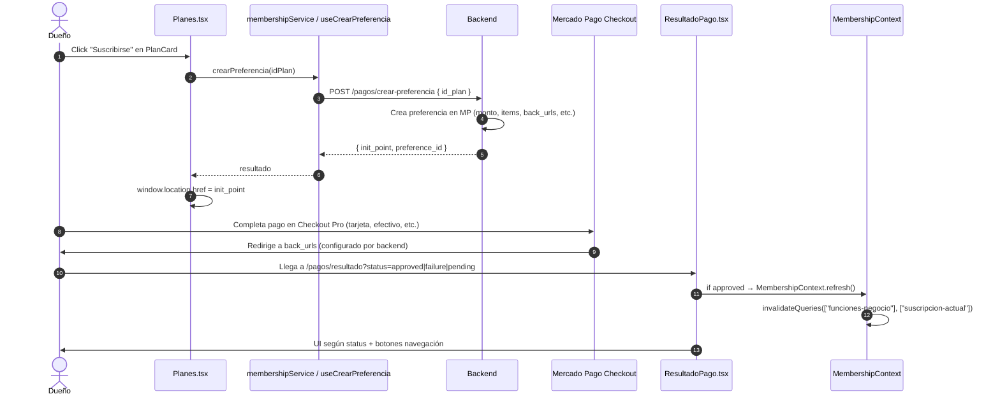

# Integración Mercado Pago — TurnoGo Frontend

Análisis completo de la integración con **Mercado Pago** en el frontend.
Separación clara: **responsabilidad del frontend** vs **responsabilidad del backend**.

---

## 1. Resumen ejecutivo

| Aspecto | Implementación en frontend |
|---------|----------------------------|
| **SDK** | `@mercadopago/sdk-react` (^1.0.7) — solo `initMercadoPago` |
| **Checkout** | **Redirect a `init_point`** (Checkout Pro clásico) |
| **Wallet / Bricks / Checkout Transparente** | **No usado** |
| **Creación de preferencia** | Backend expone `POST /pagos/crear-preferencia` → devuelve `init_point` |
| **Frontend** | Llama endpoint → `window.location.href = init_point` |
| **Resultado** | Página `/pagos/resultado?status=approved\|failure\|pending` |
| **Webhooks / Notificaciones IPN** | **Solo backend** (frontend no recibe) |
| **Sandbox / Producción** | Configurado por backend; frontend solo usa `init_point` recibido |

> **Clave**: El frontend **no calcula montos, items, ni firma preferencias**. Todo lo resuelve el backend; el frontend solo recibe la URL de redirección.

---

## 2. Flujo de pago completo



---

## 3. Responsabilidad: Frontend vs Backend

| Responsabilidad | Frontend | Backend |
|-----------------|----------|---------|
| Definir planes, precios, features | **No** (lee `GET /planes/`) | Sí (CRUD planes) |
| Calcular monto a cobrar | **No** | Sí |
| Armar items de la preferencia | **No** | Sí |
| Configurar `back_urls` / `notification_url` | **No** | Sí |
| Crear preferencia en MP | **No** (llama endpoint) | Sí (`POST /pagos/crear-preferencia`) |
| Firmar/validar preferencia | **No** | Sí |
| Inicializar SDK MP | `initMercadoPago(publicKey)` | Provee public key |
| Renderizar Wallet/Bricks | **No** | N/A |
| Redirigir a Checkout | `window.location.href = init_point` | Genera `init_point` |
| Procesar pago (tarjeta, efectivo, etc.) | **No** (página MP) | MP |
| Recibir notificación IPN / Webhook | **No** | Sí (actualiza suscripción) |
| Leer resultado final | Lee `?status=` en `/pagos/resultado` | Expone `GET /pagos/suscripcion/actual` |
| Refrescar estado membresía | `MembershipContext.refresh()` | Responde `GET /planes/negocios/:id/funciones` |

---

## 4. Código del frontend

### 4.1 Inicialización SDK (`src/lib/mercadopago.ts`)

```typescript
import { initMercadoPago } from "@mercadopago/sdk-react";

const mercadopagoPublicKey = import.meta.env.VITE_MERCADOPAGO_PUBLIC_KEY;

if (mercadopagoPublicKey) {
  initMercadoPago(mercadopagoPublicKey, { locale: "es-AR" });
}
```

- **Ejecución**: Al importar `lib/mercadopago` en `main.tsx:4`
- **Uso real**: Solo inicializa el SDK; **no se usa Wallet/Bricks** en ningún componente
- **Variable**: `VITE_MERCADOPAGO_PUBLIC_KEY` (requerida en `.env.local`)

### 4.2 Servicio de membresía (`src/features/membership/services/membership.service.ts`)

| Método | Endpoint | Body | Respuesta |
|--------|----------|------|-----------|
| `listarPlanes()` | `GET /planes/` | — | `ApiPlan[]` |
| `obtenerFuncionesNegocio(idNegocio)` | `GET /planes/negocios/:id/funciones` | — | `ApiNegocioFunciones` |
| `obtenerSuscripcionActual()` | `GET /pagos/suscripcion/actual` | — | `ApiSuscripcion \| null` |
| `crearPreferenciaPago(idPlan)` | `POST /pagos/crear-preferencia` | `{ id_plan }` | `{ init_point, preference_id }` |
| `cancelarSuscripcion(idSuscripcion)` | `POST /pagos/suscripcion/:id/cancelar` | — | `ApiSuscripcion` |
| `toggleRenovacionAutomatica(idSuscripcion, activa)` | `PUT /pagos/suscripcion/:id/renovacion-automatica` | `{ renovacion_automatica }` | `ApiSuscripcion` |

### 4.3 Hooks de mutación (`src/features/membership/hooks/useMembershipMutations.ts`)

```typescript
// Crear preferencia → redirect
export const useCrearPreferencia = () =>
  useMutation({
    mutationFn: (idPlan: number) => membershipService.crearPreferenciaPago(idPlan),
    onError: (error) => toast.error(getApiErrorMessage(error, "Error al crear el pago")),
  });

// Cancelar suscripción
export const useCancelarSuscripcion = () => {
  const queryClient = useQueryClient();
  return useMutation({
    mutationFn: (idSuscripcion) => membershipService.cancelarSuscripcion(idSuscripcion),
    onSuccess: () => {
      queryClient.invalidateQueries({ queryKey: ["suscripcion-actual"] });
      queryClient.invalidateQueries({ queryKey: ["funciones-negocio"] });
      toast.success("Suscripción cancelada correctamente");
    },
    onError: (error) => toast.error(...),
  });
}

// Toggle renovación automática
export const useToggleRenovacion = () => { ... };
```

### 4.4 Página de planes (`src/features/membership/pages/Planes.tsx`)

```typescript
const { mutateAsync: crearPreferencia, isPending } = useCrearPreferencia();

const handleSubscribe = async (idPlan: number) => {
  try {
    const result = await crearPreferencia(idPlan);
    window.location.href = result.init_point;  // <-- REDIRECT COMPLETO
  } catch {
    // error handled by mutation toast
  }
};
```

- **Lazy loaded** (`React.lazy` en `App.tsx:20`)
- Renderiza `PlanCard` por cada plan (`usePlanes()`)
- `PlanCard` recibe `onSubscribe={handleSubscribe}`

### 4.5 Página de resultado (`src/features/membership/pages/ResultadoPago.tsx`)

```typescript
const [searchParams] = useSearchParams();
const { refresh } = useMembership();
const [status] = useState<"approved"|"failure"|"pending"|null>(
  searchParams.get("status") as ...
);

useEffect(() => {
  if (status === "approved") refresh();
}, [status, refresh]);
```

- Lee `searchParams.get("status")` → `"approved" | "failure" | "pending" | null`
- Si `approved` → llama `MembershipContext.refresh()` (invalida queries de funciones/suscripción)
- UI según status: botones "Ver mi suscripción", "Reintentar", "Ir a mi suscripción", "Ir al dashboard"

### 4.6 Contexto de membresía (`src/features/membership/contexts/MembershipContext.tsx`)

```typescript
const { data: funcionesData } = useFuncionesNegocio(negocioId);

const planActual = funcionesData?.plan ?? null;
const estadoSuscripcion = funcionesData?.estado ?? null;
const fechaFin = funcionesData?.fecha_fin ?? null;
const funciones = funcionesData?.funciones ?? [];
const isFree = !planActual;

const tieneFuncion = (featureKey) => funciones.includes(featureKey);
```

- `useFuncionesNegocio` → `GET /planes/negocios/:id/funciones`
- `refresh()` → `invalidateQueries(["funciones-negocio", negocioId])`

---

## 5. Variables de entorno

| Variable | Uso | Requerida |
|----------|-----|-----------|
| `VITE_MERCADOPAGO_PUBLIC_KEY` | `initMercadoPago(publicKey)` en `lib/mercadopago.ts` | **Sí** (si no existe, SDK no inicializa) |

> El `init_point` (sandbox o producción) lo decide el **backend** al crear la preferencia. El frontend no distingue.

---

## 6. Tipos de datos (frontend)

```typescript
// src/types/api.ts
export interface ApiPlan {
  id_plan: number;
  nombre: string;
  precio: number;
  duracion_dias: number;
  descripcion: string | null;
  activo: boolean;
  feature_keys: string[];  // ["mapa_ubicacion", "imagenes_personalizadas", "soporte_prioritario"]
}

export interface ApiSuscripcion {
  id_suscripcion: number;
  estado: "activa" | "pendiente" | "vencida" | "cancelada" | "fallida";
  fecha_inicio: string;
  fecha_fin: string;
  renovacion_automatica: boolean;
  plan: ApiPlan;
}

export interface ApiNegocioFunciones {
  id_negocio: number;
  plan: string | null;
  estado: string | null;
  fecha_fin: string | null;
  funciones: string[];
}

export interface ApiCrearPreferenciaResponse {
  init_point: string;
  preference_id: string;
}
```

---

## 7. Feature Gating (plan → funcionalidades)

| Feature Key | Label UI | Usado en |
|-------------|----------|----------|
| `mapa_ubicacion` | "Mapa de ubicación" | `DashboardPersonalizacion` (via `FeatureGuard`) |
| `imagenes_personalizadas` | "Imágenes personalizadas" | `DashboardPersonalizacion` |
| `soporte_prioritario` | "Soporte prioritario" | Solo UI (no gating técnico visible) |

- `PlanCard.tsx` mapea `feature_keys` a labels via `FEATURE_LABELS`
- `FeatureGuard.tsx` usa `useMembership().tieneFuncion(key)` → muestra hijos o UI de upgrade

---

## 7. Manejo de errores

| Punto | Mecanismo |
|-------|-----------|
| Fallo al crear preferencia | `useCrearPreferencia` → `onError` → `toast.error(getApiErrorMessage(error, "Error al crear el pago"))` |
| Cancelar suscripción falla | `useCancelarSuscripcion` → `onError` → toast |
| Toggle renovación falla | `useToggleRenovacion` → `onError` → toast |
| Error de red / 401 / 5xx | `ApiClient` lanza `ApiError` → `getApiErrorMessage` extrae `detail` |
| `init_point` inválido / expirado | **No detectable en frontend** (página MP muestra error) |
| Usuario cierra Checkout sin pagar | Llega a `/pagos/resultado?status=pending` o `failure` según `back_urls` configurado por backend |

> El frontend **no valida** el estado real del pago; confía en el `status` que MP pone en la URL de retorno.

---

## 8. Qué NO hace el frontend

| Funcionalidad | Estado |
|---------------|--------|
| Renderizar Wallet / Bricks / Card Form | **No** (solo `initMercadoPago` + redirect) |
| Calcular monto / items / cuotas | **Backend** |
| Firmar preferencia / HMAC | **Backend** |
| Recibir webhook / IPN | **Solo backend** |
| Consultar estado de pago a MP directamente | **No** (usa `GET /pagos/suscripcion/actual` del backend) |
| Manejar reembolsos / disputas | **No UI** |
| Tokenizar tarjeta / guardar método de pago | **No** |
| Suscripciones recurrentes automáticas (MP Preapproval) | **No visible** (backend maneja `renovacion_automatica`) |

---

## 9. Sandbox vs Producción

| Aspecto | Detalle |
|---------|---------|
| **Detección** | Frontend **no detecta**; usa `init_point` que el backend genera apuntando a sandbox o prod |
| **Public Key** | `VITE_MERCADOPAGO_PUBLIC_KEY` debe coincidir con entorno (test vs prod) |
| **Testing** | En sandbox, `init_point` apunta a `sandbox.mercadopago.com`; en prod a `www.mercadopago.com` |
| **Frontend** | Código idéntico; solo cambia variable de entorno |

---

## 10. Archivos clave

| Archivo | Qué define |
|---------|------------|
| `src/lib/mercadopago.ts` | Inicialización SDK (`initMercadoPago`) |
| `src/features/membership/services/membership.service.ts` | Llamadas HTTP a `/planes/`, `/pagos/` |
| `src/features/membership/hooks/useMembershipMutations.ts` | `useCrearPreferencia`, `useCancelarSuscripcion`, `useToggleRenovacion` |
| `src/features/membership/hooks/useMembershipQuery.ts` | `usePlanes`, `useFuncionesNegocio`, `useSuscripcionActual` |
| `src/features/membership/contexts/MembershipContext.tsx` | Estado global de plan/funciones + `tieneFuncion` |
| `src/features/membership/pages/Planes.tsx` | UI de planes + `handleSubscribe → window.location.href = init_point` |
| `src/features/membership/pages/ResultadoPago.tsx` | Lee `?status=` + `refresh()` |
| `src/features/membership/pages/MiSuscripcion.tsx` | Detalle suscripción + cancelar + toggle renovación |
| `src/features/membership/components/PlanCard.tsx` | Tarjeta de plan + botón suscribirse |
| `src/features/membership/components/FeatureGuard.tsx` | Gating de features por plan |
| `src/types/api.ts` | Tipos `ApiPlan`, `ApiSuscripcion`, `ApiNegocioFunciones`, `ApiCrearPreferenciaResponse` |