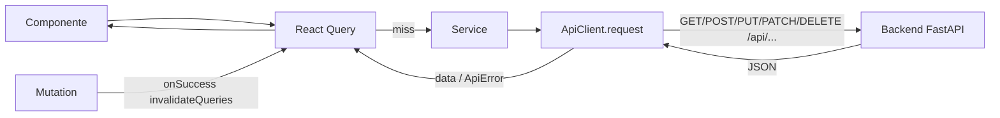
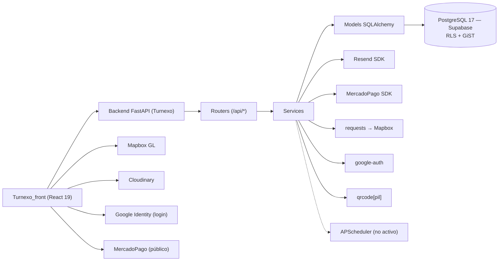

# ARQUITECTURA DEL SISTEMA — TurnoGo

Vista arquitectónica global del sistema **TurnoGo**: dos repositorios (frontend SPA + backend
API REST), su comunicación, sus capas internas, dependencias y el flujo de una petición típica.

Fuentes: `docs/ARQUITECTURA.md`, `docs/ESTRUCTURA.md`, `docs/TECNOLOGIAS.md` de **ambos**
repositorios y `docs/ESTADO_Y_DATOS.md` del frontend.

---

## 1. Visión general

```
┌───────────────────────────────┐   HTTP/JSON    ┌───────────────────────────────────────────┐
│  Turnexo_front                │  Bearer JWT    │  Turnexo (backend FastAPI)                 │
│  ┌─────────────────────────┐  │ ────────────►  │  ┌───────────┐ ┌───────────┐ ┌─────────┐  │
│  │ Componentes React (UI)  │  │               │  │  Routers  │→│ Services  │→│ Models  │  │
│  │ · Marketplace · Reserva │  │               │  │  /api/*   │ │(negocio)  │ │(ORM)    │  │
│  │ · Dashboard · Admin     │  │               │  └─────┬─────┘ └─────┬─────┘ └────┬────┘  │
│  ├─────────────────────────┤  │               │        │             │             │       │
│  │ Contextos (Auth,        │  │               │        └─────────────┴─────────────┘       │
│  │ Membership, Dashboard)  │  │               │                    │                       │
│  ├─────────────────────────┤  │               │   PostgreSQL 17 (Supabase) ←─────────┘      │
│  │ React Query (caché)     │  │               │   · índice GiST anti-solape de turnos        │
│  ├─────────────────────────┤  │               │   · RLS: catálogo público / resto cerrado    │
│  │ ApiClient (singleton)   │  │               └──────────────────────────────────────────────┘
│  └─────────────────────────┘  │
└───────────────────────────────┘
      Integraciones del frontend            Integraciones del backend
      · Mapbox GL (mapa)                    · Resend (emails) · MercadoPago (pagos)
      · Cloudinary (imágenes)               · Mapbox (geocoding) · Google OAuth (login)
      · Google Identity (login, con       · qrcode (QR en emails)
         salvedades, ver SEGURIDAD-SISTEMA)
```

**Decisiones clave de arquitectura**

1. **Frontend y backend desacoplados por HTTP**: la SPA React 19 se comunica con la API REST
   solo mediante `fetch` (envuelto en `ApiClient`), con JWT en header `Authorization: Bearer`.
2. **Backend monolítico modular**: FastAPI con routers por dominio y servicios que concentran
   la lógica de negocio (no hay microservicios).
3. **Persistencia centralizada**: PostgreSQL 17 en Supabase; el backend conecta por URL directa
   (`config('DB')`) y **no** usa el cliente `supabase-py` (ni Supabase Auth/Storage/Realtime).
4. **Estado del frontend por capas**: React state local → React Context (auth/membresía/negocio)
   → TanStack React Query (caché de servidor) → `localStorage` (sesión persistente).
5. **Autenticación propia** (no Supabase Auth): JWT HS256 emitido por el backend + verificación
   de email + 2FA por OTP.

---

## 2. Arquitectura del frontend (`Turnexo_front`)

### 2.1 Capas

```
src/
├── main.tsx                    → createRoot(<App/>) (sin StrictMode)
├── App.tsx                     → Providers + enrutado
│    QueryClientProvider → TooltipProvider → BrowserRouter
│      → AuthProvider → MembershipProvider → Suspense → rutas
├── lib/
│   ├── api-client.ts           → ApiClient (singleton, fetch, token, errores ApiError)
│   ├── api-config.ts           → API_BASE_URL = (VITE_API_URL || http://localhost:8000) + /api
│   ├── api-error.ts            → normalización de errores
│   ├── cloudinary.ts / mercadopago.ts / placeholders.ts / utils.ts
├── components/                 → UI genérica (shadcn/ui, ~51 componentes) + NavLink
├── hooks/                      → useApi, useEstadistica, queries/ y mutations/
├── features/                   → módulos por funcionalidad (carpetas feature-first):
│   ├── landing/                → páginas públicas (Index, Negocios, NegocioPerfil, ...)
│   ├── auth/                   → Login, Registro, VerificarCodigo, VerifyEmailPage, AuthContext
│   ├── booking/                → Reservar (wizard 4 pasos) + appointment.service
│   ├── business/               → NegocioPerfil, RegistrarNegocio (wizard 7 pasos)
│   ├── dashboard/              → Dashboard + subpáginas (turnos, servicios, empleados, stats...)
│   ├── membership/             → Planes, MiSuscripcion, PlanCard, FeatureGuard, context
│   └── admin/                  → AdminPanel (negocios, usuarios)
├── services/                   → business.service, servicio.service, empleado.service, ...
├── types/api.ts                → tipos (ApiNegocio, ApiServicio, ApiTurno, WeekSchedule, ...)
└── test/setup.ts               → jest-dom (Vitest)
```

### 2.2 Capa de estado (resumen)

| Capa | Mecanismo | Responsabilidad |
|---|---|---|
| UI efímera | `useState` | pasos de wizard, modales, loading local (no se usa `useReducer`) |
| Formularios | React Hook Form + Zod (`zodResolver`) | validación y estado de formularios (login, registro, onboarding, modales) |
| Estado global de app | React Context | `AuthContext` (sesión), `MembershipContext` (plan/funciones), `DashboardBusinessContext` (negocio activo) |
| Caché de servidor | TanStack React Query 5 | queries + mutations con `staleTime`/`gcTime` e invalidación |
| Persistencia | `localStorage` | `turnexo_token`, `turnexo_user`, `turnexo_pending_2fa_email` |
| Transporte | `ApiClient` singleton | fetch con token en memoria, headers, errores, redirección en 401 |

Detalle completo: `docs/ESTADO_Y_DATOS.md` (frontend).

### 2.3 Enrutado (React Router 7)

| Zona | Rutas principales |
|---|---|
| Público | `/`, `/negocios`, `/negocio/:slug`, `/reservar/:slug` |
| Auth | `/login`, `/registro`, `/verificar-codigo`, `/verify-email/:token`, `/restablecer-contrasena/:token`, `/auth-success` |
| Onboarding | `/registrar-negocio` |
| Membresía | `/planes`, `/mi-suscripcion`, `/pagos/resultado` |
| Dashboard dueño | `/dashboard` (resumen, turnos, servicios, empleados, horarios, estadisticas, configuracion, personalizacion) |
| Admin | `/admin` (negocios, usuarios) |

Detalle: `docs/ROUTING.md` (frontend).

---

## 3. Arquitectura del backend (`Turnexo`)

### 3.1 Capas y flujo de una petición

```
Cliente HTTP ──► Router (app/routers/*.py, prefijo /api)
                  │  valida con Schemas Pydantic (request/response)
                  ▼
              Dependencias de auth (get_current_user / get_current_negocio / require_feature)
                  │
                  ▼
              Service (app/services/*.py) → lógica de negocio + integraciones
                  │
                  ▼
              Modelos SQLAlchemy (app/models/*.py) → PostgreSQL (Supabase)
```

Patrón por endpoint: **una operación = una transacción** (`db.commit()` / `IntegrityError →
rollback → 409` / cierre de sesión con el generador `get_db`).

### 3.2 Rutas de la aplicación

| Pieza | Ubicación | Contenido |
|---|---|---|
| Factoria ASGI | `app/main.py` | `create_app()` → `FastAPI(title="Turnogo")`, CORS, healthchecks, montaje de routers |
| Config | `app/core/config.py` | variables de entorno con `python-decouple` (ver INFRAESTRUCTURA.md) |
| Seguridad | `app/core/security.py` | hash bcrypt + JWT HS256 (`create_access_token`) |
| Dependencias | `app/core/dependencies.py` | `get_db`, `get_current_user`, `get_current_negocio`, `require_feature` |
| Estados de turno | `app/core/estados_turno.py` | constantes + `TRANSICIONES_PERMITIDAS` |
| Roles | `app/core/roles.py` | `Roles.ADMIN = "admin"`, `Roles.DUENIO = "duenio"` |
| DB | `app/db/` | `database.py` (engine/pool), `session.py` (`get_db`), `base.py`, `seeds/` |
| Modelos | `app/models/` | 16 modelos SQLAlchemy (uno por archivo) |
| Routers | `app/routers/` | 14 routers (ver §3.3) |
| Schemas | `app/schemas/` | DTOs Pydantic por dominio |
| Services | `app/services/` | lógica de negocio e integraciones |
| Automations | `app/automations/` | esqueletos vacíos (reminder_jobs, daily_closure, whatsapp_service) |

### 3.3 Routers montados (prefijo `/api`)

| # | Dominio | Router | Prefijo | Nota |
|---|---|---|---|---|
| 1 | Healthcheck | `app/main.py` | `/` | `GET /` y `GET /db-test` |
| 2 | Autenticación | `auth_router.py` | `/api/auth` | register, login, google, me, verify-credentials, verify-2fa, resend-code, forgot/reset, verify-email, test-email (rate limit slowapi en login/register/2FA/forgot) |
| 3 | Usuarios | `usuario_router.py` | `/api/usuarios` | CRUD + `/admin` + `/{id}/estado` |
| 4 | Negocios | `negocio_router.py` | `/api/negocios` | catálogo, mapa, slug, me, complete, admin, backfill |
| 5 | Servicios | `servicio_router.py` | `/api/servicios` | CRUD + toggle |
| 6 | Empleados | `empleado_router.py` | `/api/empleados` | GET / público (con `id_negocio`); GET /{id} y POST 🔒 + propiedad |
| 7 | Clientes | `cliente_router.py` | `/api/clientes` | GET / y /{id} 🔒 (solo clientes con turnos en tus negocios); POST /get-or-create público |
| 8 | Horarios | `horarios_negocio_router.py` | `/api/horarios` | GET público; POST/PUT/DELETE 🔒 + propiedad, por `{id_negocio}` |
| 9 | Turnos | `turno_router.py` | `/api/turnos` | `disponibilidad` público (solo slots); por-rango + CRUD + `/{id}/estado` 🔒 + propiedad; POST / público |
| 10 | Categorías | `categoria_router.py` | `/api/categorias` | GET público; mutaciones 🔒 `require_role("admin")` |
| 11 | Georef | `georef_router.py` | `/api/georef` | provincias, localidades (`test-geocoding` eliminado) |
| 12 | Planes | `plan_router.py` | `/api/planes` | listado público + `negocios/{id}/funciones` 🔒 + propiedad |
| 13 | Pagos/suscripciones | `pago_router.py` | `/api/pagos` | crear-preferencia, webhook (firma `X-Signature` v2 validada), suscripción actual/cancelar/renovación |
| 14 | Estadísticas | `estadistica.py` | `/api/statistics` | `business/{id}` |

> ⚠️ **CONTRADICCIÓN DOCUMENTADA (backend interno):** `admin_router.py` existe en
> `app/routers/` pero **contiene solo código comentado** y **no está montado** en
> `app/main.py` (`ESTRUCTURA.md` backend). No hay endpoints funcionales de administración en
> el backend; el panel `/admin` del frontend consume `/negocios/admin`, `/usuarios/*`, etc.

### 3.4 Servicios externos del backend

| Servicio | Librería | Función | Archivo |
|---|---|---|---|
| Emails | `resend` | verificación, reset, OTP, confirmación (con QR), cancelación | `email_service.py` |
| Pagos | `mercadopago` SDK (`==3.3.0`) | preferencias + webhook + gestión de suscripciones | `payment_service.py` |
| Geocodificación | `requests` → Mapbox | coordenadas de dirección (AR) | `mapbox_service.py` |
| Login social | `google-auth` | validación de `id_token` de Google | `auth_service.py` |
| QR | `qrcode[pil]` | PNG del QR del turno para el email | `qr_service.py` |
| Recordatorios | APScheduler (importado) | job horario **no activado** en `main.py` | `core/scheduler_wsp.py` |

---

## 4. Flujo de una petición típica (end-to-end)

```
1. Usuario en el frontend dispara una acción (p. ej. abrir el dashboard).
2. React Query detecta falta de dato → llama al service correspondiente
   (p. ej. appointment.service.getAppointmentsByRange).
3. El service invoca ApiClient.request(...) → fetch con Authorization: Bearer <token>.
4. ApiClient inyecta el token desde memoria (seteado por AuthContext al iniciar sesión).
5. Backend: router valida el body/query (Pydantic) y la dependencia de auth
   (get_current_user / get_current_negocio).
6. Service ejecuta la lógica de negocio sobre la sesión SQLAlchemy.
7. Respuesta JSON (o 401/403/404/409/422/500) → ApiClient normaliza errores → React Query.
8. El componente renderiza (loading / datos / error) y las mutations invalidan
   las queries relacionadas para refrescar la UI.
```

Diagrama de flujo de dato del frontend (`docs/ESTADO_Y_DATOS.md`):



---

## 5. Comunicación frontend ↔ backend

- **Contrato:** JSON sobre HTTP; base del frontend `API_BASE_URL` (ver
  [INTEGRACION-FRONTEND-BACKEND.md](./INTEGRACION-FRONTEND-BACKEND.md)).
- **Autenticación:** `Authorization: Bearer <access_token>` (JWT). El token vive en memoria
  dentro de `ApiClient` y se persiste en `localStorage` (`turnexo_token`) para hidratar la
  sesión al recargar.
- **Errores:** el backend devuelve `{ "detail": "<mensaje>" }` (con excepciones como DELETE 204
  o `{"mensaje": ...}`); el frontend los normaliza en `ApiError` (`status`, `detail`) y
  redirige al login en 401.
- **CORS (backend):** `http://localhost:5173`, `https://www.turnogo.app`, `https://turnogo.app`;
  `allow_credentials=True`, métodos/headers `*`.

---

## 6. Diagrama de dependencias del sistema



---

## 7. Consideraciones arquitectónicas detectadas

1. **Acoplamiento a Supabase**: el backend depende de `DATABASE_URL` de Supabase y las
   migraciones SQL viven en `supabase/migrations/`; `alembic` está presente pero sin
   `alembic.ini`/`env.py` (esquema real definido por Supabase).
2. **Bifurcación frontend-backend en nombres**: el frontend conserva un `api-config.ts` con
   endpoints en inglés sin uso, mientras los services usan los nombres en español (ver
   [INTEGRACION-FRONTEND-BACKEND.md](./INTEGRACION-FRONTEND-BACKEND.md) §8).
3. **Servicios vacíos en backend**: `whatsapp_service.py`, `dashboard_service.py` y los
   archivos de `app/automations/` están vacíos (0 líneas); el scheduler de recordatorios no se
   arranca.
4. **Sin capa de caché distribuida / cola de tareas**: los emails se encolan con
   `BackgroundTasks` de FastAPI (best-effort, sin reintentos).
5. **Frontend con SSR-free**: `components.json` tiene `rsc: false`; no hay Server Components;
   el SEO se resuelve con meta tags y SPA rewrite en Vercel.