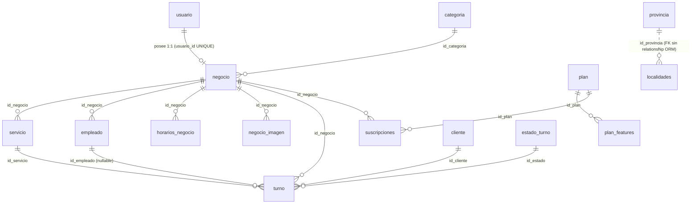
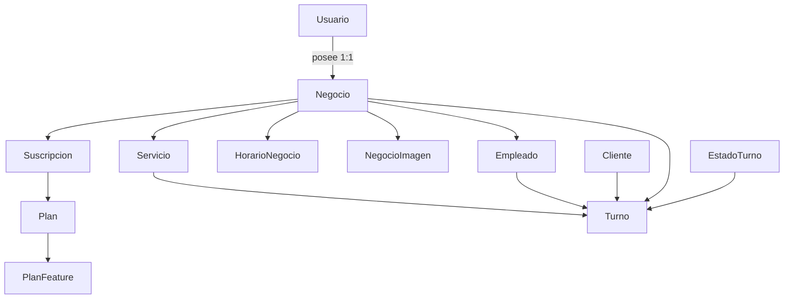

# MODELO DE DOMINIO — TurnoGo

Descripción del dominio del sistema: entidades, sus atributos, relaciones y el modelo de
datos tal como está persistido (PostgreSQL 17 / Supabase) y tipado en el frontend.

Fuentes: `docs/MODELOS.md` y `docs/BASE_DE_DATOS.md` (backend, basados en los 16 modelos
SQLAlchemy reales); `docs/ESTRUCTURA.md` (backend); tipos del frontend en `types/api.ts`
descritos en `docs/COMPONENTES.md` y `docs/ESTADO_Y_DATOS.md`.

---

## 1. Ubicación de las definiciones

| Artefacto | Ubicación |
|---|---|
| Modelos ORM (fuente de verdad) | `app/models/` del backend (16 modelos, uno por archivo) |
| Esquema SQL (migraciones) | `supabase/migrations/*.sql` del backend (esquema real) |
| DTOs Pydantic | `app/schemas/` del backend |
| Tipos del frontend | `src/types/api.ts` del frontend |

> ⚠️ **CONTRADICCIÓN DOCUMENTADA (backend interno):** `docs/BASE_DE_DATOS.md` señala que las
> migraciones SQL y los modelos ORM **pueden divergir** (p. ej. `varchar(80)` en SQL vs
> `String(30)` en ORM; `servicio.duracion_max` nullable en SQL vs `not null` en ORM). Los
> listados de esta página siguen los **modelos ORM** (fuente usada por `docs/MODELOS.md`).

---

## 2. Entidades del dominio

### 2.1 Usuario (`usuarios`)

Actor con cuenta propia. Posee **un** negocio (1:1 real por `usuario_id` UNIQUE en `negocio`).

| Campo | Tipo | Notas |
|---|---|---|
| `id_us` | int PK | |
| `usuario_us` | varchar(50) UK | nombre de usuario |
| `email_us` | varchar(100) UK | email único |
| `contrasena_us` | varchar(255) | hash bcrypt; `None` para cuentas Google |
| `role` | varchar(20) | default `"duenio"`; valores `duenio`/`admin` |
| `created_at` | datetime | |
| `estado` | bool | soft (activo/inactivo) |
| `email_verified` | bool | gate de login |
| `verification_token` + `_expiration` | varchar(255) / datetime | token 24 h |
| `reset_token` + `_expiration` | varchar(255) / datetime | |
| `otp_code` | varchar(64) | hash HMAC-SHA256 del OTP 2FA (no texto plano) |
| `otp_expires_at` / `last_2fa_verified_at` | datetime | |
| `auth_provider` | varchar(20) | `local` \| `google` |

### 2.2 Negocio (`negocio`)

Contenedor lógico de todo el sistema de reservas.

| Campo | Tipo | Notas |
|---|---|---|
| `id_negocio` | int PK | |
| `usuario_id` | int FK+UK | 1:1 con `usuarios` |
| `nombre` | varchar(150) | |
| `wsp` / `telefono` | varchar(20) | WhatsApp obligatorio |
| `direccion` / `ciudad` | varchar(200) / varchar(100) | |
| `id_localidad` / `id_provincia` | FK (SET NULL) | georef |
| `ig_url` | varchar(200) | Instagram |
| `slug` | varchar(150) UK | identidad pública (`/negocio/:slug`) |
| `logo` | varchar(255) | URL |
| `descripcion` | varchar(1000) | |
| `activo` | bool | soft delete; gate para turnos y listados |
| `id_categoria` | FK | categoría del comercio |
| `latitud` / `longitud` | float | geocodificación Mapbox |
| `creado_at` | datetime | |

Relaciones (cascade `all, delete-orphan` + `passive_deletes`): `turnos`, `servicios`,
`empleados`, `horarios`, `imagenes`, `suscripciones`, `usuario`, `categoria`.

### 2.3 Categoría (`categorias`)

| Campo | Tipo | Notas |
|---|---|---|
| `id_categoria` | int PK | |
| `nombre` | varchar(100) UK | |
| `icono` | varchar(500) | URL de imagen (validación http(s)) |
| `descripcion` | varchar(255) | |
| `created_at` | datetime | |

### 2.4 Servicio (`servicio`)

| Campo | Tipo | Notas |
|---|---|---|
| `id_servicio` | int PK | |
| `id_negocio` | FK (CASCADE) | |
| `nombre_servicio` | varchar(30) | |
| `precio` | float | se usa solo en estadísticas de facturación |
| `requiere_aprobacion` | bool | declarado pero **sin uso** en turnos |
| `duracion_min` / `duracion_max` | int | minutos; `duracion_min` fija el fin del turno |
| `activo` | bool | soft |

> `duracion_max >= duracion_min` está como CHECK en SQL, no en el modelo ORM.

### 2.5 Empleado (`empleado`)

| Campo | Tipo | Notas |
|---|---|---|
| `id_empleado` | int PK | |
| `nombre` / `apellido` | varchar(30) | |
| `telefono` | varchar(30) UK | |
| `activo` | bool | |
| `id_negocio` | FK | |

### 2.6 Cliente (`cliente`)

| Campo | Tipo | Notas |
|---|---|---|
| `id_cliente` | int PK | |
| `telefono` | varchar(30) UK | identidad para get-or-create |
| `nombre` / `apellido` | varchar(30) | |
| `email` | varchar(100) | para emails/QR |
| `created_at` | datetime | |

### 2.7 Turno (`turno`)

| Campo | Tipo | Notas |
|---|---|---|
| `id_turno` | int PK | |
| `id_negocio` / `id_servicio` / `id_empleado` / `id_cliente` / `id_estado` | FKs | empleado nullable |
| `fecha_hora_inicio` / `fecha_hora_fin` | datetime | fin opcional en modelo, siempre resuelto en creación |
| `rechazado_motivo` | text | motivo de cancelación |
| `recordatorio_enviado` | bool | flag del scheduler (no es estado) |
| `created_at` / `updated_at` | datetime | |

### 2.8 EstadoTurno (`estado_turno`)

| `id_estado` | `nombre_estado` |
|---|---|
| 1 | PENDIENTE |
| 2 | CONFIRMADO |
| 3 | COMPLETADO |
| 4 | CANCELADO |
| 5 | NO_ASISTIO |

### 2.9 HorarioNegocio (`horarios_negocio`)

| Campo | Tipo | Notas |
|---|---|---|
| `id_horarios_negocio` | int PK | |
| `id_negocio` | FK (CASCADE) | |
| `dia_semana` | int | `weekday()` 0=lunes … 6=domingo |
| `hora_apertura` / `hora_cierre` | time | `cierre <= apertura` ⇒ cruza medianoche |

### 2.10 NegocioImagen (`negocio_imagen`)

`id_imagen` PK, `id_negocio` FK, `url` varchar(500), `es_portada` bool (índice 0), `orden` int.

### 2.11 Plan (`planes`) y PlanFeature (`plan_features`)

| Plan | precio (ARS) | duración (días) | features |
|---|---|---|---|
| Free | 0 | 0 | *(ninguna)* |
| Básico | 4999 | 30 | `mapa_ubicacion` |
| VIP | 9999 | 30 | `mapa_ubicacion`, `imagenes_personalizadas`, `soporte_prioritario` |

- `Plan`: `id_plan` PK, `nombre`, `precio` (Numeric), `duracion_dias`, `descripcion`, `activo`.
- `PlanFeature`: `id_feature` PK, `id_plan` FK, `feature_key` varchar(100).
- Relación 1—N con cascade `all, delete-orphan`; `Plan.feature_keys` es property derivada.

### 2.12 Suscripción (`suscripciones`)

| Campo | Tipo | Notas |
|---|---|---|
| `id_suscripcion` | int PK | |
| `id_negocio` | FK (CASCADE) | |
| `id_plan` | FK | |
| `estado` | varchar(20) | `activa` \| `pendiente` \| `cancelada` |
| `fecha_inicio` / `fecha_fin` | datetime | |
| `renovacion_automatica` | bool | |
| `proveedor_pago` | varchar(50) | `"mercadopago"` |
| `external_subscription_id` | varchar(150) | guarda el `preference_id` de MP |
| `mp_payment_id` | varchar(150) UK | id del pago aprobado en MP; idempotencia del webhook |

### 2.13 Provincia / Localidad (`provincia`, `localidades`)

- `provincia`: `id_provincia` PK, `nombre`.
- `localidades`: `id_localidad` PK, `nombre`, `id_provincia` FK (sin `relationship` en ORM).
- Cargadas por seeds (24 provincias) y `georef_service`.

### 2.14 MetodoPago (`metodo_pago`)

`id_metd` PK, `nombre_metd`, `created_at`. **No participa** en las relaciones del dominio
(ninguna tabla la referencia).

---

## 3. Diagrama Entidad-Relación

Generado exclusivamente de los modelos ORM (relación `localidades`↔`provincia` punteada porque
existe FK pero no `relationship` en el ORM). Fuente: `docs/BASE_DE_DATOS.md` (backend).



### Diagrama de dependencias lógicas del dominio



---

## 4. Mapa entidad → recurso API (backend) → entidad frontend

| Entidad BD | Recurso API | Tipo frontend (`types/api.ts`) | Uso frontend |
|---|---|---|---|
| `usuario` | `/auth`, `/usuarios` | `User` (normalizado por AuthContext) | sesión, admin |
| `negocio` | `/negocios` | `ApiNegocio` (+ `ApiNegocioFunciones`) | marketplace, perfil, dashboard, membresía |
| `categoria` | `/categorias` | `ApiCategory` | filtros, perfil |
| `servicio` | `/servicios` | `ApiServicio` | perfil, reserva, dashboard |
| `empleado` | `/empleados` | `ApiEmpleado` | perfil, reserva, dashboard |
| `cliente` | `/clientes` | (creado vía `get-or-create`) | reserva |
| `turno` | `/turnos` | `ApiTurno` (TurnoResponse anidado) | agenda, reserva, QR |
| `estado_turno` | `/turnos/{id}/estado` | estado en `ApiTurno` | gestión de estados |
| `horarios_negocio` | `/horarios` | `WeekSchedule` / `ApiHorario` | perfil, onboarding, dashboard |
| `negocio_imagen` | `/negocios` (imágenes) | `imagenes: string[]` | galería, personalización |
| `planes` / `plan_features` | `/planes` | `ApiPlan` (feature_keys) | planes, gating |
| `suscripciones` | `/pagos` | `ApiSuscripcion` | mi suscripción |
| `provincia` / `localidades` | `/georef` | (opciones de selects) | onboarding, registro negocio |

---

## 5. Reglas de integridad relevantes en la base

1. **Anti-solape de turnos:** índice de exclusión **GiST** por empleado
   `(id_empleado, tstzrange(fecha_hora_inicio, fecha_hora_fin, '[)'))` — la DB rechaza
   solapamientos (extensión `btree_gist`). El caso **sin empleado** no tiene protección GiST
   (solo validación en aplicación).
2. **Cascadas:** `negocio` es la raíz; borrarlo elimina en cascada servicio, empleado, turnos,
   horarios, imágenes y suscripciones. `negocio.usuario_id` es UNIQUE.
3. **Soft deletes:** `estado`/`activo` en usuarios, negocios, servicios y empleados; los
   listados filtran por activo.
4. **Unicidades globales:** `usuarios.email_us`, `usuarios.usuario_us`, `cliente.telefono`,
   `categorias.nombre`, `negocio.slug`.
5. **Estados de turno:** catálogo `estado_turno` (FK) + máquina de transiciones en
   `app/core/estados_turno.py` (lógica de aplicación; la DB no la valida).
6. **"Una sola suscripción activa"** por negocio: garantizada por **lógica de servicio**
   (`procesar_pago_exitoso` / `crear_preferencia_mp`), no por constraint de BD.

---

## 6. Tipo de datos transversal

| Concepto | Representación |
|---|---|
| Fechas/horas de turno | `DateTime` (sin zona) |
| Franjas horarias | `Time` |
| Precios | `Numeric` (planes) / `Float` (servicios) |
| Duración | enteros en minutos |
| Estados de turno | `SmallInteger` FK al catálogo |
| Teléfono de cliente | varchar(30) UNIQUE (normalizado: dígitos + `+`, mínimo 8) |
| Role | varchar(20) (`duenio`/`admin`) |

---

## 7. Modelo conceptual simplificado (para la tesis)

```
Actor (Cliente) ──reserva──► Turno ──pertenece──► Negocio ──es de──► Usuario (Dueño)
                                                                      │
                                                                      ├── define Servicios, Empleados, Horarios
                                                                      └── contrata Plan (Suscripción) ──features──► PlanFeature

Turno ──tiene──► EstadoTurno (CONFIRMADO/COMPLETADO/CANCELADO/NO_ASISTIO/PENDIENTE-definido-sin-uso)
Turno ──genera──► QR (URL /dashboard/turnos?turno={id}) ──enviado──► Email de confirmación
```